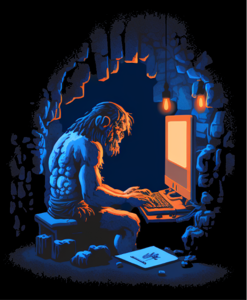
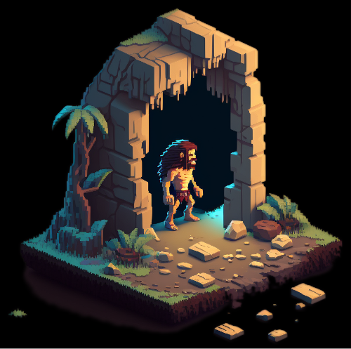
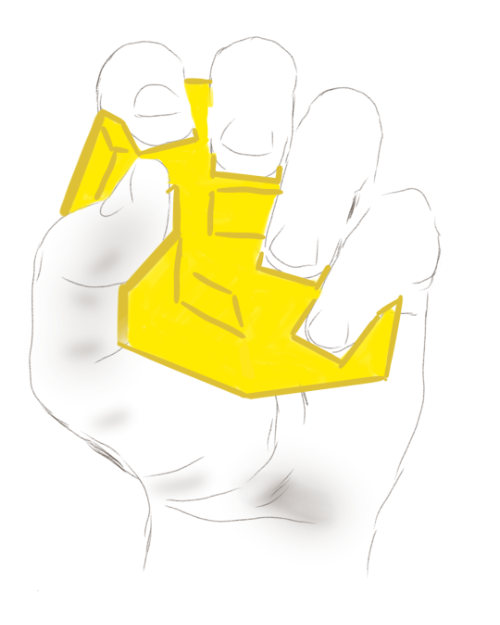

The Parapatetic Keydex

## I can't stand sitting

Do you ever feel like you're trapped in a cave?

Caveman's mind is frustrated and his body is withering.

The villain is the sedentary lifestyle.

### The Cave and the Light

Handex takes the caveman out of the "control room" (cave). They can control their creations without their environment in turn controlling the creator.

When inspiration strikes, Handex is there.

Having a computer typically means needing:

* a desk
* a chair
* a room

"Movement puts your mind in motion"

Walking -> Typeing

