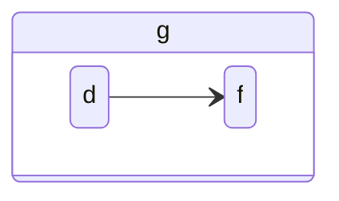

Key characters should be stable across systems.

Certain popular ASCII input processes depend on certain physically organized key arrangements.

Vim is one such system that's very popular among coders, but there are many others.

Some effort should be made, then, to align Handex key arrangements to align with this popular system, at least for the default Handex key arrangement.

We've already aligned the `asdf` and `jkl;` keys along the main single-click keystrokes of the Handex.

## The Indexable Finger-Action Ordinate System

The primary coordinates of the Handex have started with fingertip pinches, starting with the thumb and moving across to the pinky.

These are the hexadecimal _hardware_ ordinates for each finger action. These are prior to and _independent_ of any character mapping.

Action/Finger | Thumb | Index | Middel | Ring | Pinky
---|---|---|---|---|---
pinch | `0x0` | `0x1` | `0x2` | `0x3` | `0x4`
grasp | `0x5` | `0x6` | `0x7` | `0x8` | `0x9`
pull-back | `0xA` | `0xB` | `0xC` | `0xD` | `0xE`

From that table, you can see that the thumb occupies the `0x0`, `0x5`, and `0xA` ordinals.

The Thumb occupies the modulus 5 = 0 ordinals. The Index occupies the modulus 5 = 1 ordinals. The Middle occupies the modulus 5 = 2 ordinals, etc.

That helps us name all the SVGs glyphs, so the Thumb keystroke glyph is located at [https://handex.io/images/svgs/0.svg](https://handex.io/images/svgs/0.svg)

Notice that the _hardware_ finger action ordinals are _not based on keyboards_. Your finger actions are _prior to_ keyboards, and so their ordinates should not be based on how your fingers are mapped onto keyboard coordinates.

## Key to Action Mapping

Having established the _hardware_ finger actions, they can now be mapped to the keys of the standard keyboard. 

That means that the `asdf` keys would be in numeric order, starting with (in hexadecimal) `0x1`.

`0x1`=<kbd>a</kbd>=
`0x2`=<kbd>s</kbd>=
`0x3`=<kbd>d</kbd>=
`0x4`=<kbd>f</kbd>=

Those are single-click characters, corresponding to the home-row keys, but additional characters can be composed from key sequences, which are any set of keys pressed before all keys are released.

So we can compose new characters not on the home-row by combining home-row characters:

`0x21`=<kbd>g</kbd>=

 <kbd>d</kbd> + <kbd>f</kbd> --> <kbd>g</kbd>

Or:

This gives us a way of using the home-row keys to _point_ to non-home-row keys.

The <kbd>d</kbd> + <kbd>f</kbd> _points to_ the <kbd>g</kbd>.



The `jkl;` characters are sent by a single click of the grasp knuckles closer to the palm. 

`0x6`=<kbd>j</kbd>=
`0x7`=<kbd>k</kbd>=
`0x8`=<kbd>l</kbd>=
`0x9`=<kbd>;</kbd>=

So <kbd>h</kbd> can be composed from <kbd>k</kbd> + <kbd>j</kbd>



~~There is an apparent mirroring between these two pointers, but observe that both pointers point to the key next to the index finger. The mirroring happens because most keyboards are made for two hands, and your two hands are mirror images of each other. Because the Handex is made for a single hand, we use the Thumb as the origin and the Index finger as the first ordinate. So the Thumb pinch is `0x0` and the Index pinch is `0x1`.~~



The mirroring that I thought I identified above was actually just that I had a right-hand bias when mapping the QWERTY left-hand home-row keys. "A" should be under the pinky.

This made me realize that I needed a much better way to analyze the QWERTY key mapping. One step in that direction is the interactive hover-over keyboard below.



By using this QWERTY graphical analysis tool, I've remapped the number keys and most of the other keys. Nearby keys have similar mappings, now, and I think it's much easier to reason about the key strokes. I've been using it for a couple of days, and I can see a distinct improvement, even while learning the modified key layout.

This is part of the continuous improvement that I have expected since completing the first fully functioning unit a few months ago.

I will be putting together a roadmap of upcoming improvements on the project website on GitHub, where this site is hosted.