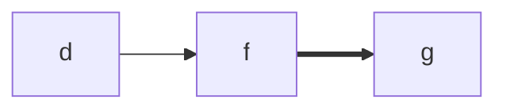
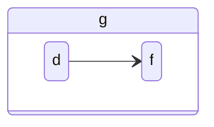

Key characters should be stable across systems.

Certain popular ASCII input processes depend on certain physically organized key arrangements.

Vim is one such system that's very popular among coders, but there are many others.

Some effor should be made, then, to align Handex key arrangements to align with this popular systems, at least for the default Handex key arrangement.

We've already aligned the asdf and jkl; keys along the main single-click keystrokes of the Handex.

The primary coordinates of the Handex have started with fingertip pinches, starting with the thumb and moving across to the pinky.

That means that the asdf keys would be in reverse numeric order, starting with (in hexidecimal) 0x1.

0x1 = a = 
0x2 = s = 
0x3 = d = 
0x4 = f = 

Those are single-click characters, coresponding to the home-row keys, but additional characters can be composed from key sequences, which are any set of keys pressed before all keys are released.

So we can compose:
0x21 = g = 

Or:


