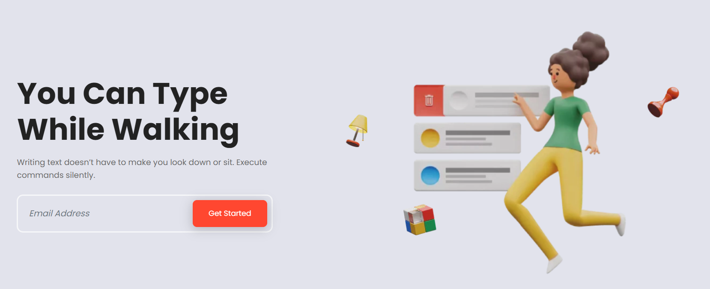
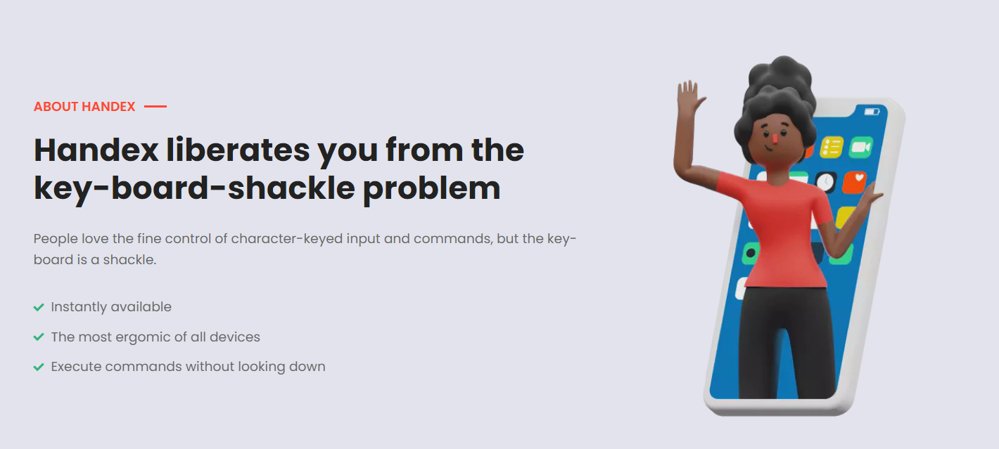
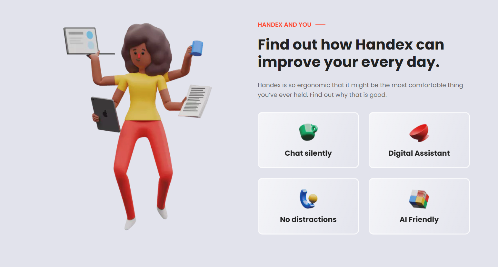
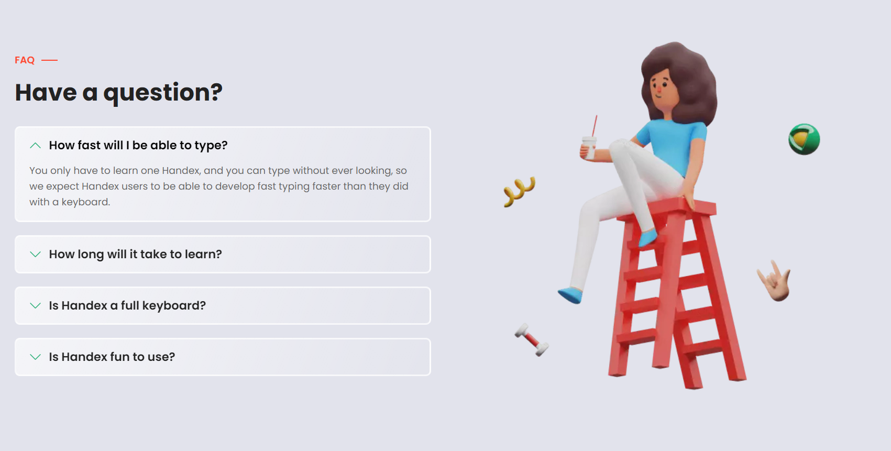

# Images to update

## _index

### Walk while typing

* Replace with an active Handex user, walking or pointing while typing
* Show an activity that draws you in, but is very commonly understood.

/images/banner/character
lamp
cube
chess

### Handex liberates you from sitting

* SHow a person getting up and away from their desk

/images/feature-image

### How can Handex improve your everyday life?

Show a more complex use-case of a person executing a command, or several images of people 

* recording
* executing
* sending
* change icons for:
*   features_items:
  - title: "Chat silently"
    image: "images/features/01.webp"
  - title: "Digital Assistant"
    image: "images/features/02.webp"
  - title: "No distractions"
    image: "images/features/03.webp"
  - title: "AI Friendly"
    image: "images/features/04.webp"

/images/featuer-image-2

### But will it work for me?

/images/feature-image-3

## About

/images/about
