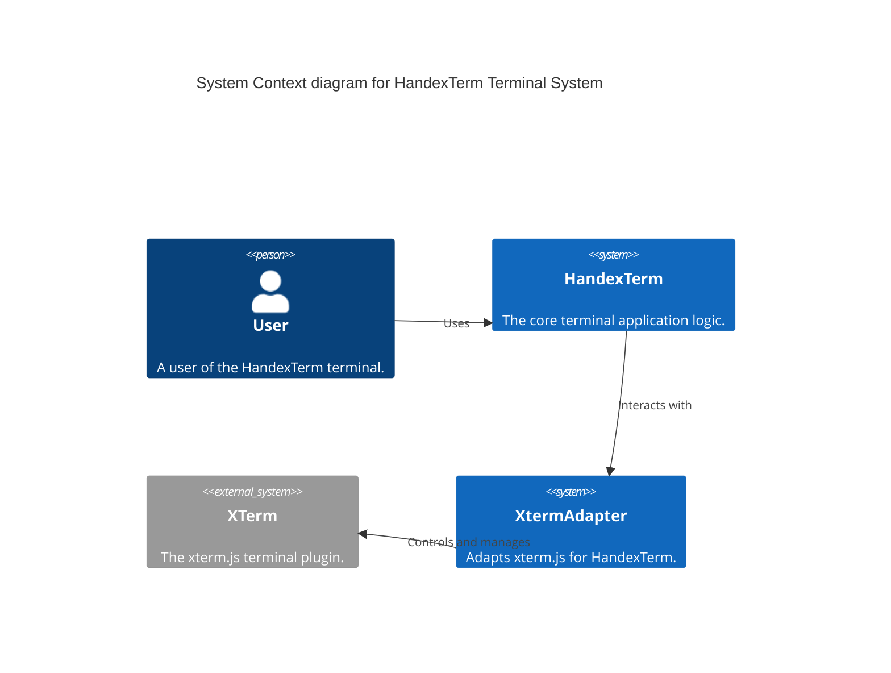
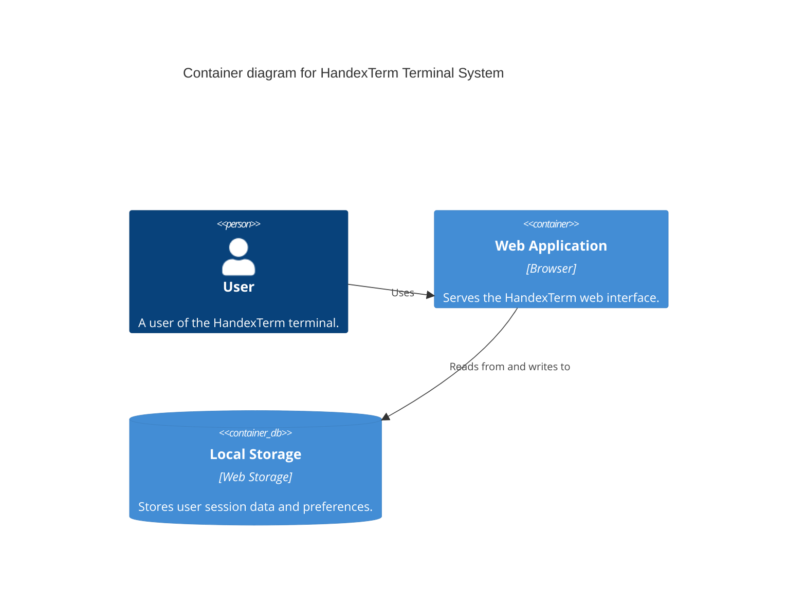

# Codeium Chat Conversation

Note: _This is purely the output of the chat conversation and does not contain any raw data, codebase snippets, etc. used to generate the output._

**User** _at 9:07 pm, Apr 17, 2024_

I want my `xterm.js` terminal app to open full-page on my Hugo `/terninal` page.

I think that means that my `terminal.md` should have a minimal `layout` associated with it but I don't know how to apply a custom layout to a single page in Hugo.

---

**Codeium** _at 9:07 pm, Apr 17, 2024_

In Hugo, to apply a custom layout to a single page, you can specify the layout in the front matter of your content file. Since you have a `terminal.md` file, you can add the `layout` parameter there to tell Hugo which layout to use for that page.

Here's how you can specify a custom layout for your `terminal.md`:

```markdown
---
title: Terminal Game
date: 2023-03-25T11:58:00
type: tutorials
layout: terminal-layout
---

Use this form to learn Handex chords in an interactive game with assistive hints.


```

In the example above, the `layout` parameter is set to `terminal-layout`. You need to create a `terminal-layout.html` file within the `layouts` directory that defines the full-page layout for your terminal app.

For example, you could place `terminal-layout.html` in `layouts/_default/` or in a more specific folder if you're organizing your layouts differently.

Here's a simple example of what `terminal-layout.html` might look like:

```html
{{ define "main" }}
<div class="terminal-full-page">
  <!-- Your terminal content will go here -->
  {{ .Content }}
</div>
{{ end }}
```

And make sure your CSS is set up so that `.terminal-full-page` is styled to take up the full page:

```css
.terminal-full-page {
  width: 100%;
  height: 100vh;
  padding: 0;
  margin: 0;
}
```

Remember to link this CSS in your layout or include it in your main stylesheet.

Now, when you visit the `/terminal` page, Hugo will use the `terminal-layout.html` to render your terminal app full-page according to the styles you define.

---

**User** _at 9:25 pm, Apr 17, 2024_

I now see the `terminal-full-page` class attribute being rendered into the browser. So that part is working. That means the custom layout file is being applied.

There is still a whole lot of other wrapping content on the page. I would like to remove all of that.

---

**Codeium** _at 9:25 pm, Apr 17, 2024_

To remove all other wrapping content and ensure that your terminal app is the only thing on the page, you will need to modify your custom layout to exclude parts like headers, footers, and any other content that is not part of your terminal app.

Here's a revised version of the `terminal-layout.html` that should render only the terminal content:

```html
<!DOCTYPE html>
<html lang="{{ .Site.LanguageCode | default "en-US" }}">
<head>
    <meta charset="UTF-8">
    <title>{{ .Title }}</title>
    {{- partial "head.html" . -}}
</head>
<body>
    <div class="terminal-full-page">
        {{ .Content }}
    </div>
    {{- partial "scripts.html" . -}}
</body>
</html>
```

This layout starts with a basic HTML structure and includes only the terminal content in the body. It assumes that you have a `head.html` partial for the head of your document (which typically contains meta tags, CSS links, etc.) and a `scripts.html` partial for the bottom of your document (which typically contains JavaScript files and scripts).

This should give you a page with only the terminal and no additional markup from your site's header, footer, or other layout components. If you need to include any specific scripts or styles for the terminal page, you can do so within the `head.html` or directly in the `terminal-layout.html` file.

Remember to check your `head.html` and `scripts.html` partials to ensure that they don't include any extra elements you don't want on the terminal page. If they do, you might need to create specific versions of these partials for the terminal layout.

---

**User** _at 10:45 pm, Apr 17, 2024_

How can I make the `xterm.js` expand to the whole page? It seems to have a fixed height of about 200px.

---

**Codeium** _at 10:45 pm, Apr 17, 2024_

The issue with `xterm.js` having a fixed height likely comes from a default style applied by the library or a conflicting CSS rule in your stylesheets. To ensure that `xterm.js` expands to the whole page, you can apply some custom CSS to the terminal container.

First, ensure that the container div for the terminal in your HTML has the `terminal-full-page` class applied:

```html
<div id="terminal" class="terminal-full-page"></div>
```

Then, apply the following CSS styles:

```css
html, body {
    height: 100%;
    margin: 0;
    padding: 0;
    background-color: #111; /* or any color you prefer */
}

.terminal-full-page {
    height: 100%;
    width: 100%;
    padding: 0;
    margin: 0;
    /* Additional styles to ensure xterm fills the container */
    display: flex;
    flex-direction: column;
}

/* You might need to apply the following rule to ensure the xterm canvas fills the container */
.xterm {
    flex-grow: 1;
}
```

In the CSS above, we're setting the `html` and `body` elements to have a height of 100% with no margins or padding, ensuring that the `.terminal-full-page` class takes up the entire viewport. The `.xterm` class is given a `flex-grow` property to ensure that it expands to fill its parent container.

Additionally, you may need to adjust the `xterm.js` terminal options to ensure it sizes dynamically according to the parent container. You can set the `resize` event listener to update the terminal's size when the window is resized:

```javascript
window.addEventListener('resize', () => {
    term.fit();
});
```

Make sure you have the fitting addon included in your `xterm.js` setup if you're using the `fit` method.

If you still face issues with the terminal size, please check if there are any specific styles applied to the `#terminal` ID or any other parent container that might be restricting the height, and adjust them accordingly.

---

**User** _at 6:33 pm, Apr 29, 2024_

I have used `npm install @xterm/xterm`, which is the recommended node module now. I have a `terminal.ts` which loads the `xterm` and `addon-fit` as perscribed by the latest `xterm.js` documentation, althought I had to copy the `xterm.css` from the `node_modules/` to the `static/css/`.

The `xterm` loads and I can see the block cursor blinking, but it won't accept text input.

---

**Codeium** _at 6:34 pm, Apr 29, 2024_

If your instance of `xterm.js` is showing the cursor but not accepting text input, it's possible that the terminal has not been correctly focused or that there is an issue with the way the input event listeners are set up.

Here are a few steps to troubleshoot and potentially resolve the issue:

1. Ensure the terminal is focused when the page loads or when a user clicks on the terminal area. You can call the `focus` method on the `Terminal` instance to give it focus.

```typescript
term.focus();
```

2. Check that your `Terminal` instance is properly set up to handle input. Ensure you have attached a `onData` listener to handle incoming data.

```typescript
term.onData(data => {
    // Handle the input data (e.g., send to server or process locally)
});
```

3. If you want to process input locally (for example, to implement a local echo or command line), you need to handle that in the `onData` callback.

```typescript
term.onData(data => {
    term.write(data); // Local echo
    // Additional processing...
});
```

4. If your terminal is meant to connect to a backend service (like a shell), ensure that the backend service is correctly wired up to receive input from the terminal and send output back to it. This often involves setting up a WebSocket connection or similar.

5. Make sure that the `xterm.css` file is correctly included in your page so that styles are applied properly. Since you copied `xterm.css` to `static/css/`, link it in your HTML or Hugo template:

```html
<link rel="stylesheet" href="/css/xterm.css">
```

6. Ensure that there are no JavaScript errors in the browser's console that could be preventing the terminal from working correctly.

7. If you're using the `fit` addon to make the terminal size dynamic, ensure it's properly imported and applied. For `xterm.js` version 4 or later, it would look something like this:

```typescript
import { Terminal } from 'xterm';
import { FitAddon } from 'xterm-addon-fit';

const term = new Terminal();
const fitAddon = new FitAddon();
term.loadAddon(fitAddon);

// Fit the terminal when the page is loaded and when the window is resized
window.addEventListener('load', () => fitAddon.fit());
window.addEventListener('resize', () => fitAddon.fit());
```

If you've checked all these steps and the terminal still doesn't accept input, please provide more details about your `terminal.ts` setup and any relevant HTML or JavaScript code so that I can offer a more specific solution.

---

**User** _at 6:37 pm, Apr 29, 2024_

I hadn't implemented the `onData()`. I can see the text input now, but it doesn't send it to the command history. I will probably have to code all that, which I already have some code for.

How to I specify the `xterm` prompt and style?

---

**Codeium** _at 6:38 pm, Apr 29, 2024_

In `xterm.js`, the prompt is not a built-in feature; you need to implement it yourself. The prompt is simply a piece of text that you write to the terminal to indicate to the user that they can enter a command. You can customize the prompt's appearance by writing ANSI escape codes to the terminal.

Here's an example of how you might implement a prompt in `xterm.js`:

```typescript
import { Terminal } from 'xterm';

// Create a new terminal instance
const term = new Terminal();
term.open(document.getElementById('terminal'));

// Function to write the prompt to the terminal
function writePrompt() {
  term.write('\x1b[1;34muser@host:\x1b[0m\x1b[1;32m~$\x1b[0m ');
}

// Call the writePrompt function to display the prompt when the terminal is ready
term.onData((data) => {
  // Handle the input data here (e.g., add to command history, process commands)
});

term.onRender(() => {
  writePrompt();
});
```

In the `writePrompt` function, `\x1b[1;34m` and `\x1b[1;32m` are ANSI escape codes that set the text color. The `\x1b[0m` escape code resets the formatting to default. You can customize these codes to style the prompt as you wish.

For example:
- `\x1b[1;34m` sets the text to bright blue.
- `\x1b[1;32m` sets the text to bright green.
- `\x1b[0m` resets the text formatting.

You can find a full list of ANSI escape codes to customize the colors and styles to your preference.

To handle command history, you would typically maintain an array of entered commands and an index to keep track of the current position in the history. When the user presses the up or down arrow keys, you can change the index and display the corresponding command from the history array.

Here's a rudimentary example of command history handling:

```typescript
let commandHistory = [];
let historyIndex = -1;

term.onData((data) => {
  // This is a simple example and doesn't handle all edge cases
  switch (data) {
    case '\u0003': // Ctrl+C
      term.write('^C');
      break;
    case '\r': // Enter
      // Process the command here
      commandHistory.push(currentInput);
      historyIndex = commandHistory.length;
      // ... (send command for processing, clear current input, etc.)
      break;
    case '\u001b[A': // Up arrow
      if (historyIndex > 0) {
        historyIndex--;
        term.write('\r\x1b[K' + commandHistory[historyIndex]); // Clear line and show history item
      }
      break;
    case '\u001b[B': // Down arrow
      if (historyIndex < commandHistory.length - 1) {
        historyIndex++;
        term.write('\r\x1b[K' + commandHistory[historyIndex]); // Clear line and show history item
      }
      break;
    // Handle other input cases (e.g., backspace, printable characters)
  }
});
```

In this code, `\u0003` is the Unicode control character for Ctrl+C, `\r` signifies carriage return (Enter), `\u001b[A` and `\u001b[B` are the escape sequences for the up and down arrow keys, respectively. The `\r\x1b[K` escape sequence clears the current line.

Keep in mind that this is a simplified example. In a real application, you'd need to handle additional edge cases and complexities, such as multi-line inputs or more sophisticated command parsing logic.

---

**User** _at 8:02 pm, Apr 29, 2024_

How do I creat an instance of a type in TypeScript?

---

**Codeium** _at 8:02 pm, Apr 29, 2024_

In TypeScript, creating an instance of a type (assuming you're referring to a class) is done using the `new` keyword followed by the class name and any required constructor parameters enclosed in parentheses.

Here's a basic example:

```typescript
class MyClass {
  constructor(public property: string) {
    // Constructor logic here
  }

  myMethod(): void {
    console.log(this.property);
  }
}

// Creating an instance of MyClass
const myInstance = new MyClass("Hello, world!");

// Using a method of the instance
myInstance.myMethod(); // Output: "Hello, world!"
```

In the example above, `MyClass` is a simple class with a constructor that takes one parameter. To create an instance of `MyClass`, you use `new MyClass("Hello, world!")`.

If you're referring to creating an instance of an object with a specific shape (like an interface or type alias), you can't directly instantiate an interface or type alias because they are used only for type checking and are not transpiled into JavaScript. However, you can create an object that adheres to the shape of an interface or type alias like so:

```typescript
interface MyInterface {
  property: string;
  myMethod(): void;
}

// Creating an object that conforms to MyInterface
const myObject: MyInterface = {
  property: "Hello, TypeScript!",
  myMethod: function(): void {
    console.log(this.property);
  }
};

// Using a method of the object
myObject.myMethod(); // Output: "Hello, TypeScript!"
```

In this case, `myObject` is not an instance of a class, but rather an object literal that matches the structure defined by `MyInterface`.

---

**User** _at 8:03 pm, Apr 29, 2024_

If I create a `type Person { first:string, last:string}`, how do I crreate `Bob` of `type Person`?

---

**Codeium** _at 8:03 pm, Apr 29, 2024_

In TypeScript, you can define a `type` using the `type` keyword, and then create an object that adheres to that type. Here's how you would define the `Person` type and create an object representing `Bob`:

```typescript
type Person = {
  first: string;
  last: string;
};

// Creating an object 'Bob' of type Person
const Bob: Person = {
  first: 'Bob',
  last: 'Smith'
};
```

In this example, `Bob` is an object with properties `first` and `last` that match the structure defined by the `Person` type. When you assign an object literal to `Bob`, TypeScript will check that it conforms to the `Person` type. If you miss any properties or add extra ones, TypeScript will give you a compilation error.

---

**User** _at 9:40 pm, Apr 29, 2024_

how can I round a number to three decimlam places in TypeScript?

---

**Codeium** _at 9:40 pm, Apr 29, 2024_

In TypeScript, as in JavaScript, you can round a number to a specified number of decimal places using the `toFixed` method, which returns a string, or by using mathematical operations to round to a number.

Here's how you can use both methods to round a number to three decimal places:

Using `toFixed` (returns a string representation):

```typescript
let num: number = 123.456789;
let roundedString: string = num.toFixed(3); // "123.457"
let roundedNumber: number = parseFloat(roundedString); // Converts it back to number
```

Using mathematical rounding (returns a number):

```typescript
let num: number = 123.456789;
let roundedNumber: number = Math.round(num * 1000) / 1000; // 123.457
```

In the mathematical approach, you multiply the number by 10 to the power of the number of decimal places you want to round to (10^3 for three decimal places), use `Math.round` to round to the nearest integer, and then divide by the same power of 10 to get back to the correct scale.

---

**User** _at 7:49 am, Apr 30, 2024_

Back to our discussion about implementing `xterm`. When I add this:

```ts
term.onRender(() => {
  writePrompt();
});
```

I get an infinite loop.

I also have this:

```ts
function writePrompt() {
  term.write('\x1b[1;34muser@host:\x1b[0m\x1b[1;32m~$\x1b[0m ');
}
term.onData(data => {
  term.write(data);
})
```

---

**Codeium** _at 7:49 am, Apr 30, 2024_

The infinite loop occurs because `writePrompt()` is being called every time `xterm.js` renders, which happens after any data is written to the terminal, including by `writePrompt()` itself.

To avoid this, you should ensure that `writePrompt()` is only called when necessary, such as after a command is processed or when the terminal is first opened.

Here's a revised approach:

```typescript
function writePrompt() {
  // Write the prompt to the terminal
  term.write('\r\n\x1b[1;34muser@host:\x1b[0m\x1b[1;32m~$\x1b[0m ');
}

term.onData(data => {
  // Echo the input data to the terminal
  term.write(data);

  // If the Enter key is pressed, process the input and then write the prompt
  if (data.charCodeAt(0) === 13) {
    // Process the command here (not shown)

    // Write the prompt on a new line
    writePrompt();
  }
});

// Call writePrompt once when the terminal is first initialized
writePrompt();
```

In this example, the prompt is written once outside of any event handlers to initialize it. Then, inside the `onData` handler, it checks for the Enter key (carriage return, char code `13`). After processing the command, it calls `writePrompt()` to display a new prompt on the next line.

This way, the prompt will only be written after a command has been entered rather than on every render, preventing the infinite loop.

---

**User** _at 9:54 am, Apr 30, 2024_

I've gotten the `xterm` plugin partly working but now I see some overlap with my [@class:TerminalGame](cci:2://d:\T3\Projects\self\handex.io\assets\ts\terminal.ts:174:0-409:1) and the other functions I have in my `terminal.ts`.

I think it would be good to review my existing code and refactor it into something more industry-standard. I am rather new to TypeScript, so I will need your TypeScript expertise. Should I start with abstracting out the type and class declarations into another file? 

I would like to have three domains, the `TerminalGame` which will contain not-yet-implemented typing game functions, `HandexTerm` which will contain my product-specific terminal handling logic, and `xTerm` which will implement the `HandexTerm` logic into the `xterm.js` as a plugin, so that I don't tightly couple my `HandexTerm` too tightly to `xterm.js`.

We should also consider abstracting out a persistence layer, for command/response history and WPM logging. I am currently using `localStorage`, but I will be implementing a server storage implementation shortly. 

How should we begin?

---

**Codeium** _at 9:55 am, Apr 30, 2024_

Refactoring your code for better structure and maintainability is a great idea. Given your plan to have three distinct domains (`TerminalGame`, `HandexTerm`, and `xTerm`), along with a persistence layer, you can start by organizing your code into modules. Modules in TypeScript are a great way to encapsulate and organize related code.

Here's a potential approach to get started with the refactoring:

1. **Create Separate Modules**: Split your code into different files, each representing a module. For example:

   - `TerminalGame.ts`: Contains the `TerminalGame` class with game-specific logic.
   - `HandexTerm.ts`: Contains the `HandexTerm` class with product-specific terminal handling logic.
   - `XtermAdapter.ts`: Contains the `XtermAdapter` class that integrates `HandexTerm` with `xterm.js`.
   - `Persistence.ts`: Contains logic related to saving and retrieving data, abstracting away the storage mechanism.

2. **Define Interfaces**: Define interfaces to specify the contracts that your classes should adhere to. For example, you can have an interface for the persistence layer that can be implemented for different storage options.

3. **Abstract and Implement Persistence**: Create a persistence interface and then implement it using `localStorage`. When you're ready to switch to server storage, you can create a new implementation without affecting the rest of your code.

4. **Use Dependency Injection**: Pass dependencies (like instances of `HandexTerm` or the persistence interface implementation) to classes that need them. This helps decouple your classes and makes testing easier.

5. **Refactor Gradually**: Start by moving types and interfaces into separate modules, then tackle the larger classes. Refactor incrementally and test as you go to ensure that each change doesn't break your application.

Here's an example of how your modules and interfaces could be structured:

**HandexTerm.ts**
```typescript
// HandexTerm.ts
export interface IHandexTerm {
  // Define the interface for your HandexTerm logic
  handleInput(input: string): void;
  // Other product-specific terminal logic
}

export class HandexTerm implements IHandexTerm {
  // Implement the interface methods
  handleInput(input: string): void {
    // Implementation goes here
  }
  // Additional product-specific methods and properties
}
```

**XtermAdapter.ts**
```typescript
// XtermAdapter.ts
import { Terminal } from '@xterm/xterm';
import { IHandexTerm } from './HandexTerm';

export class XtermAdapter {
  private term: Terminal;

  constructor(private handexTerm: IHandexTerm) {
    this.term = new Terminal();
    // Set up xterm.js with event listeners and configurations
    this.term.onData(data => {
      this.handexTerm.handleInput(data);
    });
    // Additional setup
  }

  // Methods to integrate xterm.js functionality with HandexTerm
}
```

**Persistence.ts**
```typescript
// Persistence.ts
export interface IPersistence {
  saveCommandHistory(command: string): void;
  loadCommandHistory(): string[];
  // Other persistence-related methods
}

export class LocalStoragePersistence implements IPersistence {
  saveCommandHistory(command: string): void {
    // Use localStorage to save the command history
  }

  loadCommandHistory(): string[] {
    // Use localStorage to load the command history
    return [];
  }
  // Additional methods using localStorage
}
```

**TerminalGame.ts**
```typescript
// TerminalGame.ts
import { IPersistence } from './Persistence';
import { IHandexTerm } from './HandexTerm';

export class TerminalGame {
  constructor(private handexTerm: IHandexTerm, private persistence: IPersistence) {
    // Game-specific initialization
  }

  // Game logic methods
}
```

Once you have these modules, you can import them into your main application file and wire them together using dependency injection:

**main.ts**
```typescript
// main.ts
import { TerminalGame } from './TerminalGame';
import { HandexTerm } from './HandexTerm';
import { XtermAdapter } from './XtermAdapter';
import { LocalStoragePersistence } from './Persistence';

const handexTerm = new HandexTerm();
const persistence = new LocalStoragePersistence();
const xtermAdapter = new XtermAdapter(handexTerm);
const terminalGame = new TerminalGame(handexTerm, persistence);

// Now you can use terminalGame to start the game
```

By following this approach, you'll create a maintainable structure that separates concerns and makes it easier to modify each part of your application independently.

---

**User** _at 10:12 am, Apr 30, 2024_

That is very helpful. That's the type of advice I was looking for. 

Now, I've also factored out `WPMCalculator` into `WPMCalculator.ts`, but I am noticing that there are several small types like this:

```ts
const TerminalCssClasses = {
  Terminal: 'terminal',
  Line: 'terminal-line',
  Output: 'terminal-output',
  Input: 'terminal-input',
  Prompt: 'prompt',
  Head: 'head',
  Tail: 'tail',
  LogPrefix: 'log-prefix',
  LogTime: 'log-time',
} as const;

const LogKeys = {
  CharTime: 'char-time',
  Command: 'command',
} as const;

type TimeCode = string;
type TimeHTML = string;
type CharDuration = {
  character: string;
  durationMilliseconds: number;
}
type CharWPM = {
  character: string;
  wpm: number;
}
```

Is it common to put each of those into a separate file and then have a giant import in `main.ts`? Or how is that usually handeld in TypeScript?

---

**Codeium** _at 10:13 am, Apr 30, 2024_

In TypeScript, it's common to group related types, interfaces, constants, and utility functions into modules to keep the code organized and maintainable. However, it's not necessary to put each small type or constant into its own file, especially if they are closely related or used together. Instead, you can create a few well-organized files that group these related declarations logically.

Here are some common approaches to organizing these smaller pieces:

1. **Domain-Specific Modules**: Group types, interfaces, and constants by domain or functionality. For example, if `TerminalCssClasses` and `LogKeys` are related to terminal styling and logging, they could be in a file named `TerminalTypes.ts`.

2. **Utility Modules**: For general utility types and functions that are used across different parts of the application, you can have a `Utils.ts` or similar file.

3. **Shared Types and Constants Modules**: If you have shared types and constants that don't necessarily belong to a specific domain, you can have a `CommonTypes.ts` or `Constants.ts` file.

Here's an example of how you might reorganize the types and constants you provided:

**TerminalTypes.ts**
```typescript
// TerminalTypes.ts

export const TerminalCssClasses = {
  Terminal: 'terminal',
  Line: 'terminal-line',
  Output: 'terminal-output',
  Input: 'terminal-input',
  Prompt: 'prompt',
  Head: 'head',
  Tail: 'tail',
  LogPrefix: 'log-prefix',
  LogTime: 'log-time',
} as const;

export const LogKeys = {
  CharTime: 'char-time',
  Command: 'command',
} as const;

export type TimeCode = string;
export type TimeHTML = string;
export type CharDuration = {
  character: string;
  durationMilliseconds: number;
};
export type CharWPM = {
  character: string;
  wpm: number;
};

// Additional related types and constants...
```

**main.ts**
```typescript
// main.ts

import { TerminalGame } from './TerminalGame';
import { HandexTerm } from './HandexTerm';
import { XtermAdapter } from './XtermAdapter';
import { LocalStoragePersistence } from './Persistence';
import { WPMCalculator } from './WPMCalculator';
import { TerminalCssClasses, LogKeys } from './TerminalTypes';

// Use the imported types and constants as needed...
```

By grouping related items together, you reduce the number of import statements and keep your codebase easier to navigate. When a module starts getting too large, you can consider splitting it into smaller, more focused modules.

Keep in mind that organizing code is somewhat subjective and depends on the preferences of your team and the specifics of your project. The goal is to make the code easy to understand, maintain, and scale.

---

**User** _at 10:53 am, Apr 30, 2024_

This line is giving me a linting error:

```ts
const handexTerm = new HandexTerm();
```

That's in this code:

```ts
import { TerminalGame } from './TerminalGame';
import { HandexTerm } from './HandexTerm';
import { XtermAdapter } from './XtermAdapter';
import { LocalStoragePersistence } from './Persistence';
import { TerminalCssClasses, LogKeys } from './TerminalTypes';
import { createElement } from 'ts/utils/dom';

const handexTerm = new HandexTerm();
const persistence = new LocalStoragePersistence();
const xtermAdapter = new XtermAdapter(handexTerm);
const terminalGame = new TerminalGame(handexTerm, persistence);
```

That's in `main.ts`

---

**Codeium** _at 10:54 am, Apr 30, 2024_

The linting error for the line `const handexTerm = new HandexTerm();` could be due to a few different reasons, such as:

1. **Missing Constructor Arguments**: If the `HandexTerm` constructor expects one or more arguments, you need to provide them when creating an instance.

2. **Unused Variable**: If `handexTerm` is never used, the linter might complain about an unused variable. However, this seems unlikely since it's being passed to `XtermAdapter` and `TerminalGame`.

3. **Instantiation of an Abstract Class**: If `HandexTerm` is an abstract class, you cannot create an instance of it directly and the linter would point that out.

4. **Linter Configuration Issues**: There might be rules in your linting configuration that are triggering an error.

To resolve the issue, you'll need to check the specific error message provided by the linter. It will give you more details about what's wrong. If it's a missing argument error, you'll need to update the constructor call to pass the required arguments. If it's an abstract class instantiation error, you'll need to subclass `HandexTerm` and create an instance of the subclass, or remove the `abstract` keyword from the `HandexTerm` class definition if it shouldn't be abstract.

Without the specific error message, it's hard to give a precise solution, but reviewing the error details should point you in the right direction. If you're able to share the error message, I could provide more targeted advice.

---

**User** _at 12:16 pm, Apr 30, 2024_

Ok, I've moved some things around and I've gotten the site to compile and run, but I think I may have lost track of how the modules are supposed to fit together.

I have this in my `main.ts`:

```ts
document.addEventListener('DOMContentLoaded', () => {
  const terminalContainer = document.getElementById('terminal');
  if (terminalContainer) {
    // const terminalGame = new TerminalGame(terminalContainer);
    const fitAddon = new FitAddon();
    xTerm.loadAddon(fitAddon);
    xTerm.open(terminalContainer);
    fitAddon.fit();
    writePrompt();
  }
});
```

And this is at the top of that file:

```ts
// main.ts
import { IHandexTerm } from './HandexTerm';
import { XtermAdapter } from './XtermAdapter';
import { IPersistence } from './Persistence';


// Now you can use terminalGame to start the game
import { Terminal } from '@xterm/xterm';
import { FitAddon } from '@xterm/addon-fit';
function pipe<T, R>(value: T, fn: (arg: T) => R): R {
  return fn(value);
}

var xTerm = new Terminal();
```

---

**Codeium** _at 12:17 pm, Apr 30, 2024_

It looks like you've set up the basic instantiation of `Terminal` from `xterm.js` and its `FitAddon` in your `main.ts`, but the `TerminalGame`, `HandexTerm`, and `XtermAdapter` modules don't seem to be integrated yet.

Based on the initial discussion, your `main.ts` should be creating instances of your custom classes and wiring them together. Here's a suggested structure based on the provided code snippets and previous discussions:

1. Instantiate `HandexTerm` and `LocalStoragePersistence` (or another `IPersistence` implementation).
2. Create an instance of `XtermAdapter` and pass it the `HandexTerm` instance.
3. Instantiate `TerminalGame` with `HandexTerm` and your persistence layer.
4. In the DOMContentLoaded event, you should open the terminal and attach it to the `terminalContainer`.

Here's how the code could look after integrating your modules:

**main.ts**
```typescript
// Import your custom modules and types
import { IHandexTerm, HandexTerm } from './HandexTerm';
import { XtermAdapter } from './XtermAdapter';
import { IPersistence, LocalStoragePersistence } from './Persistence';
import { TerminalGame } from './TerminalGame';

// Import xterm.js and its addons
import { Terminal } from '@xterm/xterm';
import { FitAddon } from '@xterm/addon-fit';

// Instantiate your custom classes
const persistence: IPersistence = new LocalStoragePersistence();
const handexTerm: IHandexTerm = new HandexTerm(persistence); // Assuming HandexTerm expects a persistence layer
const xtermAdapter = new XtermAdapter(handexTerm); // XtermAdapter might expect an IHandexTerm
const terminalGame = new TerminalGame(handexTerm, persistence);

// Instantiate xterm.js terminal and fit addon
var xTerm = new Terminal();
const fitAddon = new FitAddon();

// This function could be part of TerminalGame or HandexTerm
function writePrompt(): void {
  // Implementation for writing the prompt to the terminal
}

// Event listener for when the DOM is fully loaded
document.addEventListener('DOMContentLoaded', () => {
  const terminalContainer = document.getElementById('terminal');
  if (terminalContainer) {
    // Attach the fit addon and open the terminal in the container
    xTerm.loadAddon(fitAddon);
    xTerm.open(terminalContainer);
    fitAddon.fit();

    // Write the initial prompt to the xterm.js terminal
    writePrompt();

    // Integrate xterm.js with your custom terminal logic
    xtermAdapter.attachToXterm(xTerm); // This method needs to be implemented in XtermAdapter
  }
});
```

Please note:
- `HandexTerm` could require a persistence layer; if it does, you'd pass the instantiated `LocalStoragePersistence` to it.
- `XtermAdapter` needs to be updated to attach event handlers and other necessary logic to integrate `HandexTerm` with `xTerm`. A method like `attachToXterm` should be added to `XtermAdapter` for this purpose.
- `writePrompt` might be part of your `TerminalGame` or `HandexTerm`. It's called after opening the terminal to show the initial prompt.
- Ensure that you have methods in place within `XtermAdapter` to handle the integration between `xTerm` and your custom `HandexTerm`. This includes attaching data handlers and other interactions.
- `TerminalGame` should encapsulate game-specific logic and might also handle initializing the prompt and terminal interactions.

If your `HandexTerm`, `XtermAdapter`, or `TerminalGame` classes require additional setup or constructor arguments, make sure to update the instantiation accordingly. You may also need to adjust method names and logic to fit the actual implementation of your classes.

---

**User** _at 1:28 pm, Apr 30, 2024_

Ok, I like the general idea of that code, but I am unclear about the relationship between the `HandexTerm`, and the `XTermAdapter`. 

I think this is the Adapter Pattern? Is that correct?

---

**Codeium** _at 1:29 pm, Apr 30, 2024_

Yes, you are indeed considering the Adapter Pattern. The Adapter Pattern is a design pattern that allows objects with incompatible interfaces to work together. It acts as a bridge between two incompatible interfaces or classes.

In the context of your application, `XtermAdapter` serves as an adapter between your custom terminal handling logic (`HandexTerm`) and the third-party `xterm.js` library (`Terminal` class). Here's a conceptual overview of how these components interact:

- **`HandexTerm`**: This is your application-specific terminal handling logic. It encapsulates the behavior and processing that are unique to your application, such as handling user input, command execution, and maintaining state.

- **`XtermAdapter`**: This class adapts the interface of `xterm.js` to the interface expected by `HandexTerm`. It translates data from `xterm.js` events into a format that `HandexTerm` can understand and process. Conversely, it can take output from `HandexTerm` and render it through the `xterm.js` terminal.

- **`Terminal` (from `xterm.js`)**: This is the third-party library that provides a terminal in the browser. It deals with all the low-level details of rendering the terminal UI and capturing user input.

Here's a simplified TypeScript example to illustrate the Adapter Pattern:

```typescript
// HandexTerm.ts
export interface IHandexTerm {
  processInput(input: string): void;
  // Other methods...
}

export class HandexTerm implements IHandexTerm {
  processInput(input: string): void {
    // Application-specific input processing
  }
  // Other methods...
}

// XtermAdapter.ts
import { Terminal } from '@xterm/xterm';
import { IHandexTerm } from './HandexTerm';

export class XtermAdapter {
  private terminal: Terminal;

  constructor(private handexTerm: IHandexTerm) {
    this.terminal = new Terminal();
    this.terminal.onData((data: string) => {
      this.handexTerm.processInput(data);
    });
  }

  attachToXterm(xterm: Terminal): void {
    // Attach the handexTerm logic to the xterm.js terminal
    xterm.onData((data: string) => {
      this.handexTerm.processInput(data);
    });
    // Optionally, you can translate output from HandexTerm to xterm here
  }

  // Other methods to integrate xterm functionality with HandexTerm
}

// main.ts
import { HandexTerm } from './HandexTerm';
import { XtermAdapter } from './XtermAdapter';

const handexTerm = new HandexTerm();
const xtermAdapter = new XtermAdapter(handexTerm);

// Now, XtermAdapter is bridging the third-party xterm.js terminal with HandexTerm
```

With the Adapter Pattern, you can easily switch out the `xterm.js` library for another terminal library in the future without having to rewrite `HandexTerm`, or vice versa. It provides a flexible structure that decouples the core business logic from the third-party library details.

---

**User** _at 1:43 pm, Apr 30, 2024_

Ok, I like that. I am having one problem though. 

The constructor for `HandexTerm` expects a `HTMLElement`. This is from how the `div.terminal` was attached before. I don't quite understand how to modify the `HandexTerm` code, much of which modifies the `div.terminal`, to conform ot the new Adapter Pattern we are using.

```ts
 constructor(private handexTerm: HTMLElement, private persistence: IPersistence) {
```

---

**Codeium** _at 1:43 pm, Apr 30, 2024_

To modify `HandexTerm` to conform to the Adapter Pattern, you'll want to remove direct DOM manipulation from `HandexTerm` and instead focus on the abstract terminal logic. `HandexTerm` should not be aware of the specific implementation details of the terminal UI, such as `HTMLElements`. That responsibility should be moved to `XtermAdapter`, which will bridge the gap between `HandexTerm` and `xterm.js`.

To achieve this, consider the following changes:

1. **Refactor `HandexTerm`**: Remove the `HTMLElement` dependency from the constructor and any DOM manipulation code. Instead, `HandexTerm` should work with abstract input and output methods.

2. **Update `XtermAdapter`**: Let `XtermAdapter` handle the creation and manipulation of the `HTMLElement` that `xterm.js` uses to render the terminal. It will also translate DOM events into the abstract input that `HandexTerm` expects.

Here's a conceptual refactoring:

**HandexTerm.ts**
```typescript
import { IPersistence } from './Persistence';

export interface IHandexTerm {
  processInput(input: string): void;
  // Other methods...
}

export class HandexTerm implements IHandexTerm {
  // Remove the HTMLElement from the constructor
  constructor(private persistence: IPersistence) {}

  processInput(input: string): void {
    // Application-specific input processing
  }

  // Abstract output method that the adapter will use to render output
  output(data: string): void {
    // Implement logic to handle terminal output
    // For example, store output in a buffer or pass to a callback
  }
  
  // Other methods...
}
```

**XtermAdapter.ts**
```typescript
import { Terminal } from '@xterm/xterm';
import { IHandexTerm } from './HandexTerm';

export class XtermAdapter {
  private terminal: Terminal;

  constructor(private handexTerm: IHandexTerm, private terminalElement: HTMLElement) {
    this.terminal = new Terminal();
    this.terminal.open(terminalElement);
    this.terminal.onData((data: string) => {
      this.handexTerm.processInput(data);
    });
  }

  // Method to render data to the terminal
  renderOutput(data: string): void {
    this.terminal.write(data);
  }
}
```

**main.ts**
```typescript
import { HandexTerm } from './HandexTerm';
import { XtermAdapter } from './XtermAdapter';
import { LocalStoragePersistence } from './Persistence';

document.addEventListener('DOMContentLoaded', () => {
  const terminalContainer = document.getElementById('terminal');
  if (terminalContainer) {
    const persistence = new LocalStoragePersistence();
    const handexTerm = new HandexTerm(persistence);
    const xtermAdapter = new XtermAdapter(handexTerm, terminalContainer);
    // Now, xtermAdapter is bridging the third-party xterm.js terminal with HandexTerm
    
    // Optionally, if you have output from HandexTerm to display, use xtermAdapter.renderOutput
    handexTerm.output = (data: string) => {
      xtermAdapter.renderOutput(data);
    };
    
    // ... other initialization code ...
  }
});
```

In this refactoring, `HandexTerm` now only deals with abstract terminal logic and delegates the rendering of output to `XtermAdapter`. `XtermAdapter` takes care of creating the `xterm.js` terminal instance, attaching it to the DOM, and translating data between `HandexTerm` and `xterm.js`. This separation of concerns aligns with the Adapter Pattern and gives you the flexibility to change the underlying terminal implementation in the future.

---

**User** _at 4:16 pm, Apr 30, 2024_

I have this code, but I don't think it's handling input correctly. Nothing happens when I try to type.

```json
document.addEventListener('DOMContentLoaded', () => {
  const terminalContainer = document.getElementById('terminal');
  if (terminalContainer) {
    const persistence = new LocalStoragePersistence();
    const handexTerm = new HandexTerm(persistence);
    const xtermAdapter = new XtermAdapter(handexTerm, terminalContainer);
    // Now, xtermAdapter is bridging the third-party xterm.js terminal with HandexTerm

    // Optionally, if you have output from HandexTerm to display, use xtermAdapter.renderOutput
    handexTerm.output = (data: string) => {
      xtermAdapter.renderOutput(data);
    };
  }
});
```

---

**Codeium** _at 4:17 pm, Apr 30, 2024_

The issue with input handling may be related to how events are wired up between `xterm.js`, `XtermAdapter`, and `HandexTerm`. Let's ensure the following:

1. `HandexTerm` should have a method to process input, which should be called by `XtermAdapter` when `xterm.js` emits an `onData` event.
2. `XtermAdapter` should correctly wire up `xterm.js`'s `onData` event to call `HandexTerm`'s input processing method.
3. The `output` property or method on `HandexTerm` should be implemented to handle output.

Here's what each part might look like:

**HandexTerm.ts**
```typescript
// Assuming HandexTerm processes input and also handles output
export class HandexTerm {
  constructor(private persistence: IPersistence) {}

  processInput(input: string): void {
    // Process the input here...
    // For example, you could echo the input back as output
    this.output(input);
  }

  // Implement output with a method that the adapter can call
  output(data: string): void {
    // Handle output, this could be storing in persistence or passing to a callback
  }
}
```

**XtermAdapter.ts**
```typescript
// XtermAdapter is responsible for bridging xterm.js with HandexTerm
export class XtermAdapter {
  private terminal: Terminal;

  constructor(private handexTerm: HandexTerm, terminalElement: HTMLElement) {
    this.terminal = new Terminal();
    this.terminal.open(terminalElement);
    // Wire up the onData event to HandexTerm's processInput
    this.terminal.onData((data: string) => {
      this.handexTerm.processInput(data);
    });
  }

  // Call this method to render data to the terminal
  renderOutput(data: string): void {
    this.terminal.write(data);
  }
}
```

In `main.ts`, you attach `handexTerm.output` to `xtermAdapter.renderOutput`. It looks correct, but ensure both `output` and `renderOutput` are correctly implemented as shown above.

If you've set everything up correctly and typing still doesn't produce any visible result, there may be other issues:

- Check if `processInput` in `HandexTerm` is correctly implemented and that it calls the `output` method.
- Ensure that `output` in `HandexTerm` actually sends the data back to `XtermAdapter` for rendering. It should call `xtermAdapter.renderOutput`.
- Verify if there are any errors in the browser's console that could indicate a problem with the event handling or other parts of the code.
- Double-check if `xterm.js` is correctly styled and is receiving focus. You might need to explicitly call `this.terminal.focus()` in `XtermAdapter` after opening the terminal.

Ensure that all parts are correctly integrated and that the `onData` event is being triggered when you type in the terminal. Debugging with console logs inside the `processInput` and `renderOutput` methods can help you trace whether the input is being received and handled properly.

---

**User** _at 4:22 pm, Apr 30, 2024_

Ok, my existing code was using `handleKeyPress(event)`, but the `handleInput` only takes a string and so must already handle `Enter` and `ctrl+c`

---

**Codeium** _at 4:23 pm, Apr 30, 2024_

Yes, that's correct. In the context of `xterm.js`, the `onData` event handler receives a string that represents the input data from the terminal, which includes not only printable characters but also control sequences for non-printable keys like Enter (`\r`) and Ctrl+C (`\x03`).

In your `HandexTerm` class, the `processInput` method (or similarly named method) should be designed to handle these cases. For example, you might want to execute a command when the Enter key is pressed or handle an interrupt when Ctrl+C is input. Here's a basic example of how you might handle these cases:

**HandexTerm.ts**
```typescript
export class HandexTerm {
  // Other properties and methods...

  constructor(private persistence: IPersistence) {
    // Constructor logic...
  }

  processInput(input: string): void {
    // Handle special key sequences like Enter and Ctrl+C
    if (input === '\r') { // Enter key
      // Execute the command or handle a new line
    } else if (input === '\x03') { // Ctrl+C
      // Handle the interrupt signal, maybe clear the current line or command
    } else {
      // Handle regular character input
      // Append the input to the current command buffer, echo back, etc.
    }

    // Call the output method to update the terminal display
    this.output(/* some output based on the input */);
  }

  output(data: string): void {
    // Output the data to the terminal
    // This method would be connected to the renderOutput of XtermAdapter
  }

  // Other methods...
}
```

In `XtermAdapter`, you simply connect `xterm.js`'s `onData` event to `HandexTerm`'s `processInput` method. This way, `HandexTerm` is responsible for interpreting the input data and deciding what to do with it.

**XtermAdapter.ts**
```typescript
export class XtermAdapter {
  private terminal: Terminal;

  constructor(private handexTerm: HandexTerm, terminalElement: HTMLElement) {
    this.terminal = new Terminal();
    this.terminal.open(terminalElement);

    // Wire up the onData event to HandexTerm's processInput
    this.terminal.onData((data: string) => {
      this.handexTerm.processInput(data);
    });
  }

  // Method to render data to the terminal, called by HandexTerm's output method
  renderOutput(data: string): void {
    this.terminal.write(data);
  }
}
```

Lastly, in `main.ts`, you make sure to connect the `output` method of `HandexTerm` to the `renderOutput` method of `XtermAdapter`:

**main.ts**
```typescript
// ... (inside the DOMContentLoaded listener)

const handexTerm = new HandexTerm(persistence);

// Connect HandexTerm's output to XtermAdapter's renderOutput
handexTerm.output = (data: string) => {
  xtermAdapter.renderOutput(data);
};

// ...
```

Make sure to test the input handling thoroughly, including special keys, and adjust your logic accordingly. The `processInput` method can grow complex depending on how sophisticated your command handling needs to be. You might want to consider parsing the input into commands, arguments, etc., and handle different cases as needed for your application.

---

**User** _at 4:52 pm, Apr 30, 2024_

Ok, I think I have most of that working. Now when I type in the terminal I can see the text, but when I hit `Enter` it just moves the cursor to the biginning of the line. 

How do I blank out the line, and does `xTerm.js` have any output area feature, or do I just use the one I already have?

---

**Codeium** _at 4:52 pm, Apr 30, 2024_

When you hit `Enter` and the cursor just moves to the beginning of the line, it's likely because you're only receiving the carriage return character (`\r`). In terminal emulators, you typically need to handle both the carriage return (`\r`) and the newline (`\n`) characters to move the cursor to the next line.

To blank out the line and move to the next line after hitting `Enter`, you would write a newline character to the terminal after processing the input. In `xterm.js`, writing `\r\n` will move the cursor to the beginning of the next line.

Regarding the output area, `xterm.js` treats the entire terminal as an area where you can write text. If you want to separate input from output visually, you would need to manage that in the way you handle and display the text within the terminal. There is no built-in "output area" feature distinct from the rest of the terminal; it's all one continuous text buffer.

Here's how you might handle the `Enter` key in `HandexTerm`:

**HandexTerm.ts**
```typescript
export class HandexTerm {
  // Other properties and methods...

  constructor(private persistence: IPersistence) {
    // Constructor logic...
  }

  processInput(input: string): void {
    if (input === '\r') { // Enter key
      // Process the current command
      // ...

      // Once processing is done, move to the next line
      this.output('\r\n'); // Carriage return and newline to move cursor to next line

      // Optionally, write the prompt for the next command
      this.output('user@host:~$ ');
    } else {
      // Handle other input
      this.output(input); // Echo back the input or handle as needed
    }
  }

  output(data: string): void {
    // Output the data to the terminal
    // This method would be connected to the renderOutput of XtermAdapter
  }

  // Other methods...
}
```

Make sure that the `output` method in `HandexTerm` is connected to `XtermAdapter`'s `renderOutput`, so that anything you pass to `output` gets written to the terminal.

**XtermAdapter.ts**
```typescript
export class XtermAdapter {
  // ...
  renderOutput(data: string): void {
    this.terminal.write(data);
  }
}
```

**main.ts**
```typescript
// ... (inside the DOMContentLoaded listener)

const handexTerm = new HandexTerm(persistence);
handexTerm.output = (data: string) => {
  xtermAdapter.renderOutput(data);
};

// ...
```

With this setup, when you press `Enter`, the input line should be processed, the line should be cleared, and the cursor should move to the next line, where you can display the new prompt. Remember to ensure that any processing of the command (if needed) is done before writing the newline characters and the new prompt to the terminal.

---

**User** _at 5:17 pm, Apr 30, 2024_

Ok, now I see that the `xterm.js` just adds input directly into the terminal area and makes the previous commands read-only. 

I was producing some desirable affects in my earlier implementation by completely clearing the terminal prompt area every time I executed a command, and then adding the command and the command results to an upper `commandOutput` HTML div.

In that way I was able to use extensive HTML formatting features in the output.

Is there any way I can do that with `xterm.js`? Can I completely clear the prompt areay after each command?

---

**Codeium** _at 5:17 pm, Apr 30, 2024_

`xterm.js` provides a method called `clear` which clears the terminal viewport and buffer, allowing you to start with a clean slate. However, it's important to note that `xterm.js` is primarily a text buffer and does not support rich HTML formatting like a standard web page. If you want to display complex HTML formatted output, you'll need to manage a separate DOM element outside of `xterm.js` for that purpose.

If you still want to clear the input area and display command results in a separate HTML element, you can combine `xterm.js` for input with a separate output area managed by the DOM. Here's how you can approach this:

1. Keep using `xterm.js` for user input and the interactive command prompt.
2. Create a separate `div` element in your HTML to serve as the command output area.
3. After executing a command, clear the `xterm.js` terminal and print the new prompt.
4. Display the command results in the separate `div` using HTML formatting.

Here's an example setup:

**HTML Structure**
```html
<div id="commandOutput" class="command-output"></div>
<div id="terminal" class="xterm"></div>
```

**CSS**
```css
.command-output {
  /* Your styles for the command output area */
}
.xterm {
  /* Your styles for the xterm.js terminal */
}
```

**JavaScript/TypeScript**
```typescript
export class HandexTerm {
  // Other properties and methods...

  constructor(private persistence: IPersistence, private commandOutputElement: HTMLElement) {
    // Constructor logic...
  }

  processInput(input: string): void {
    if (input === '\r') { // Enter key
      // Process the current command
      const commandResult = this.executeCommand(/* current command */);
      
      // Clear the terminal input area
      this.output('\x1b[2J\x1b[3J\x1b[H'); // ANSI escape codes to clear the screen and move cursor to home position

      // Display the command result in the separate output area
      this.commandOutputElement.innerHTML = commandResult; // Assuming commandResult is HTML formatted

      // Write the new prompt
      this.output('user@host:~$ ');
    } else {
      // Handle other input
      // ...
    }
  }

  executeCommand(command: string): string {
    // Execute the command and return the result as HTML formatted string
    // ...
    return '<span class="result">Command executed successfully!</span>';
  }

  output(data: string): void {
    // Output the data to the terminal
    // ...
  }

  // Other methods...
}
```

**main.ts**
```typescript
// ... (inside the DOMContentLoaded listener)

const commandOutputElement = document.getElementById('commandOutput');
const persistence = new LocalStoragePersistence();
const handexTerm = new HandexTerm(persistence, commandOutputElement);
handexTerm.output = (data: string) => {
  xtermAdapter.renderOutput(data);
};

// ...
```

This approach allows you to use `xterm.js` for handling the interactive command input while also enabling rich HTML formatting for the command output. Keep in mind that this is a conceptual example and you'll need to adapt it to fit the specific details of your application.

---

**User** _at 7:59 pm, Apr 30, 2024_

In order to call `clear()` on `xterm` from the `HandexTerm` logic, don't I need to do it through the `XTermAdapter`? Doesn't that create a circular dependency between `HandexTerm` and `XTermAdapter`?

---

**Codeium** _at 8:00 pm, Apr 30, 2024_

Yes, you're correct. Calling `clear()` on `xterm` from within `HandexTerm` would require access to the `xterm` instance, which is managed by `XtermAdapter`. To avoid a circular dependency, you should not directly reference `xterm` from `HandexTerm`. Instead, you can define a method in `XtermAdapter` that `HandexTerm` can call to clear the terminal. This method would internally call `xterm.clear()`.

Here's how you can set up this relationship without creating a circular dependency:

1. **Define a clear method in `XtermAdapter`:**
```typescript
export class XtermAdapter {
  // ... existing code ...

  // Method to clear the terminal
  clear(): void {
    this.terminal.clear();
  }

  // ... existing code ...
}
```

2. **Pass a callback to `HandexTerm`:**
Instead of passing the entire `XtermAdapter` instance to `HandexTerm`, you can pass a specific callback (or set of callbacks) that `HandexTerm` can use to interact with the terminal. This is a form of dependency injection that avoids tight coupling between `HandexTerm` and `xterm`.

For example, you might pass a callback to clear the terminal:

**main.ts**
```typescript
// ... (inside the DOMContentLoaded listener)

// Create the XtermAdapter
const xtermAdapter = new XtermAdapter(terminalContainer);

// Create the HandexTerm, passing a callback for clearing the terminal
const handexTerm = new HandexTerm(persistence, () => xtermAdapter.clear());

// ... existing code ...
```

3. **Use the callback in `HandexTerm`:**
```typescript
export class HandexTerm {
  private clearTerminal: () => void;

  constructor(private persistence: IPersistence, clearTerminalCallback: () => void) {
    this.clearTerminal = clearTerminalCallback;
  }

  processInput(input: string): void {
    if (input === '\r') { // Enter key
      // Process the command ...

      // Clear the terminal using the provided callback
      this.clearTerminal();

      // Write the new prompt
      this.output('user@host:~$ ');
    } else {
      // Handle other input ...
    }
  }

  // ... existing code ...
}
```

In this way, `HandexTerm` can request that the terminal be cleared without needing to know about `XtermAdapter` or `xterm.js`. This preserves the separation of concerns and the single responsibility principle, reducing the risk of a circular dependency.

---

**User** _at 8:05 pm, Apr 30, 2024_

That's slightly better than having a circular dependency but wouldn't it be better to just build the `clear()` handler into the `XtermAdapter.terminal.onData()` handler?

---

**Codeium** _at 8:06 pm, Apr 30, 2024_

Yes, integrating the `clear()` logic directly into the `XtermAdapter` is indeed a cleaner approach. By doing so, you encapsulate all interactions with the `xterm.js` terminal within the adapter. This keeps the `HandexTerm` class focused on application logic, without being concerned with terminal-specific behaviors.

To implement this, you can modify the `onData` handler in the `XtermAdapter` to check for the Enter keypress (or any other condition that should trigger a clear) and clear the terminal as needed.

Here is an example of how you might integrate the clear logic into the `XtermAdapter`:

**XtermAdapter.ts**
```typescript
export class XtermAdapter {
  private terminal: Terminal;

  constructor(private handexTerm: HandexTerm, terminalElement: HTMLElement) {
    this.terminal = new Terminal();
    this.terminal.open(terminalElement);

    // Wire up the onData event to HandexTerm's processInput
    this.terminal.onData((data: string) => {
      // Check if the Enter key was pressed
      if (data === '\r') {
        // Process the command before clearing the terminal
        this.handexTerm.processInput(data);

        // Clear the terminal after processing the command
        this.clear();
        
        // Write the new prompt after clearing
        this.prompt();
      } else {
        // For other input, just pass it to the HandexTerm's processInput
        this.handexTerm.processInput(data);
      }
    });
  }

  // Method to clear the terminal
  clear(): void {
    this.terminal.clear();
  }

  // Method to write the prompt to the terminal
  prompt(): void {
    this.terminal.write('user@host:~$ ');
  }
}
```

In this setup, `HandexTerm` doesn't need to know about clearing the terminal. Instead, `XtermAdapter` takes care of clearing the terminal when necessary.

Remember that `processInput` in `HandexTerm` should no longer attempt to clear the terminal or write the prompt, as those responsibilities have been moved to the `XtermAdapter`.

**HandexTerm.ts**
```typescript
export class HandexTerm {
  // Other properties and methods...

  processInput(input: string): void {
    // Process input without worrying about clearing the terminal or writing the prompt
    // ...
  }

  // Other methods...
}
```

With this approach, you have a clear separation of concerns: `HandexTerm` handles the application logic, while `XtermAdapter` manages terminal input/output and other terminal-specific behaviors. This design also prevents `HandexTerm` from depending on the specific terminal implementation, which is a good practice for maintainability and testing.

---

**User** _at 8:29 pm, Apr 30, 2024_

How can I convert HTML text into a DOM HTMLElement in TypeScript?

---

**Codeium** _at 8:29 pm, Apr 30, 2024_

To convert an HTML string into a DOM `HTMLElement` in TypeScript, you can use the `DOMParser` API. Here's an example function that takes an HTML string and returns an `HTMLElement`:

```typescript
function createHTMLElementFromHTML(htmlString: string): HTMLElement {
  const parser = new DOMParser();
  const doc = parser.parseFromString(htmlString, 'text/html');
  return doc.body.firstChild as HTMLElement;
}

// Usage example:
const htmlString = `<div class="my-class">Content of the element</div>`;
const htmlElement = createHTMLElementFromHTML(htmlString);
console.log(htmlElement); // This will be an HTMLElement that you can manipulate and insert into the DOM
```

Note that `doc.body.firstChild` will return the first element of the parsed HTML content. If your HTML string contains multiple top-level elements, you may want to handle this accordingly, for instance by iterating over `doc.body.childNodes` or appending all child nodes to a document fragment or another parent element.

---

**User** _at 9:30 pm, Apr 30, 2024_

I have a `private onDataHandler(data: string): void`. Can I call that from `this.terminal.onData()`?

---

**Codeium** _at 9:30 pm, Apr 30, 2024_

Yes, you can call your `private onDataHandler(data: string): void` method from within the `this.terminal.onData()` callback. When you set up the event listener with `onData`, you can reference the `onDataHandler` directly, assuming both are in the same class context.

Here is an example of how you might set this up within your `XtermAdapter` class:

```typescript
export class XtermAdapter {
  private terminal: Terminal;

  constructor(terminalElement: HTMLElement) {
    this.terminal = new Terminal();
    this.terminal.open(terminalElement);

    // Set up the onData event listener to call the onDataHandler method
    this.terminal.onData(this.onDataHandler.bind(this));
  }

  // Define the onDataHandler as a private method
  private onDataHandler(data: string): void {
    // Handle the data from the terminal
    console.log(data); // Replace this with your actual handling logic
  }
}
```

In this setup, the `onData` event listener calls `this.onDataHandler.bind(this)` to ensure that `this` within `onDataHandler` refers to the instance of `XtermAdapter`, not the `Terminal` instance. The `bind` method creates a new function with the same body and scope as `onDataHandler`, but with `this` set to the `XtermAdapter` instance.

By using `bind`, you maintain the proper `this` context when the event handler is invoked by `xterm.js`. This way, you can access other methods and properties of `XtermAdapter` within `onDataHandler`.

---

**User** _at 10:56 pm, Apr 30, 2024_

I am trying to create this:

```ts
 processInput(input: string): HTMLElement {
  // Handle special key sequences like Enter and Ctrl+C
  let outputElement = new HTMLDivElement();
  if (input === '\r') { // Enter key
   // Execute the command or handle a new line
   this.clearCommandHistory();
   let outputElement = this.handleCommand(input);
  } else if (input === '\x03') { // Ctrl+C
   // Handle the interrupt signal, maybe clear the current line or command
  } else {
   // Handle regular character input
   // Append the input to the current command buffer, echo back, etc.
  }

  // Call the output method to update the terminal display
  return outputElement;
 }
```

I want that method of the `class HandexTerm` to accept a command and return an HTMLElement to the `XtermAdapter` so it can put it in the `div.terminal-output`, but I am getting an browser 
error that `HTMLDivElement()` is an illegal constructuor.

---

**Codeium** _at 10:57 pm, Apr 30, 2024_

The error you're encountering is because `HTMLDivElement` is an interface for HTML `div` elements in the DOM, and not a constructor that you can instantiate directly with `new`. To create a `div` element, you should use the `document.createElement` method.

Here's how you can modify your `processInput` method to create and return an `HTMLDivElement`:

```typescript
processInput(input: string): HTMLElement {
  let outputElement: HTMLElement;

  if (input === '\r') { // Enter key
    // Execute the command or handle a new line
    this.clearCommandHistory();
    outputElement = this.handleCommand(input);
  } else if (input === '\x03') { // Ctrl+C
    // Handle the interrupt signal, maybe clear the current line or command
    outputElement = document.createElement('div'); // Create a new div for the output
    // Perhaps insert some content or message indicating the interrupt
    outputElement.textContent = '^C';
  } else {
    // Handle regular character input
    // Append the input to the current command buffer, echo back, etc.
    outputElement = document.createElement('div'); // Create a new div for the output
    // For example, echo back the input
    outputElement.textContent = input;
  }

  // The outputElement now contains the result or response
  return outputElement;
}

private handleCommand(command: string): HTMLElement {
  // Logic to handle the command and return an HTMLElement representing the output
  const commandOutputElement = document.createElement('div');
  // ... populate commandOutputElement with the command result ...

  return commandOutputElement;
}

private clearCommandHistory(): void {
  // Logic to clear the command history
  // ...
}
```

In this corrected code, `document.createElement('div')` is used to create a new `div` element each time you need to generate output. The `handleCommand` method is assumed to return an `HTMLElement` as well, which you can populate with the results of the command execution.

Remember to append `outputElement` to the DOM where appropriate, such as within the `XtermAdapter` or wherever you manage the `div.terminal-output`.

---

**User** _at 6:50 am, May 1, 2024_

I looked a little closer and realized that I should probably handle `Ctrl+C` in the `XtermAdapter`, so I don't need to return an empty `HTMLElement`.

 I seem to be able to handle quite a lot in the Adapter, but it can also become a little unclear what should go in the Adapter and what should go in the HandexTerm.

---

**Codeium** _at 6:51 am, May 1, 2024_

It's a good realization that handling terminal control sequences like `Ctrl+C` could be more appropriate within the `XtermAdapter`. The Adapter Pattern is meant to adapt an interface for one object to be used by another, so it's natural for the adapter to handle interface-specific details like control sequences and input/output translation.

Here's how you might think about the responsibilities:

- **`XtermAdapter`**: Should handle all interactions with the `xterm.js` library, including:
  - Rendering text to the terminal.
  - Handling terminal-specific input events (like `Ctrl+C` or other control sequences).
  - Translating input from the terminal into a cleaner, more abstract form for `HandexTerm` to process.
  - Clearing the terminal or managing other terminal-specific behaviors.

- **`HandexTerm`**: Should handle the application logic, including:
  - Processing commands and generating output based on those commands.
  - Managing command history, if applicable.
  - Interacting with the persistence layer to save or retrieve data.
  - Generating output in a format that can be easily adapted and rendered by `XtermAdapter`.

By keeping these responsibilities separate, you maintain a clear separation of concerns, which can make your code easier to maintain and extend.

For instance, to handle `Ctrl+C` within `XtermAdapter`, you could do something like this:

```typescript
export class XtermAdapter {
  // ... existing properties and methods ...

  constructor(private handexTerm: HandexTerm, terminalElement: HTMLElement) {
    this.terminal = new Terminal();
    this.terminal.open(terminalElement);

    // Wire up the onData event to HandexTerm's processInput
    this.terminal.onData((data: string) => {
      if (data === '\x03') { // Ctrl+C
        this.handleCtrlC();
      } else {
        this.handexTerm.processInput(data);
      }
    });
  }

  private handleCtrlC(): void {
    // Handle Ctrl+C behavior, such as clearing the current input
    // or sending an interrupt signal to the HandexTerm process
  }
}
```

In this setup, `XtermAdapter` directly handles the `Ctrl+C` sequence, and only calls `processInput` on `HandexTerm` for other data. This keeps `HandexTerm` focused on processing commands rather than dealing with terminal control sequences.

By following this strategy, you can avoid cluttering `HandexTerm` with terminal-specific logic, keeping it clean and focused on the higher-level application logic, and leaving the lower-level terminal handling to `XtermAdapter`.

---

**User** _at 6:59 am, May 1, 2024_

Are you familiar with C4 diagrams in Mermaid? Would you be able to create a C4 diagram that represents that adapter relationship between the `HandexTerm`, the `XtermAdapter`, and the `XTerm` plugin?

---

**Codeium** _at 6:59 am, May 1, 2024_

Yes, I'm familiar with C4 diagrams, which are used to describe software architecture at different levels of abstraction. However, it's important to note that generating visual diagrams such as C4 is beyond the capabilities of a text-based conversation like this one.

Nonetheless, I can provide you with a Mermaid representation that you could use in a Mermaid-compatible viewer to generate a visual C4 diagram. Here's a simple C4 representation using Mermaid syntax that illustrates the relationship between `HandexTerm`, `XtermAdapter`, and the `xterm.js` plugin (referred to as `XTerm`):



This Mermaid code provides a high-level overview of the system's context, showing the primary systems and users involved. You can use a Mermaid-compatible tool or integration, such as Mermaid Live Editor or a Markdown renderer that supports Mermaid, to visualize this diagram.

Remember that C4 diagrams can be very detailed, and you could expand this to include more systems, containers, components, and code elements based on the C4 model's levels (Context, Container, Component, and Code). The above diagram is a simplified version that captures the high-level relationships in your system.

---

**User** _at 7:06 am, May 1, 2024_

What would the Container and Component levels look like?

---

**Codeium** _at 7:06 am, May 1, 2024_

The Container level in a C4 diagram zooms in on the system in question (in this case, `HandexTerm`) and shows the high-level technologies, protocols, and responsibilities of each container within it. Containers are applications, data stores, or services that execute code or store data.

The Component level breaks down individual containers to show the components inside them. Components are parts of a container, which together make up an application. At this level, you would show more specific details about the major structural building blocks and their interactions.

Here’s an example of how the Container and Component diagrams might look for the `HandexTerm` system, using Mermaid syntax:

**Container Diagram**


**Component Diagram**
```mermaid
C4Component
title Component diagram for HandexTerm Web Application

Container(webApp, "Web Application", "Browser", "Serves the HandexTerm web interface.")

Component(handexTerm, "HandexTerm", "TypeScript", "Processes user commands and manages session.")
Component(xtermAdapter, "XtermAdapter", "TypeScript", "Adapts xterm.js for HandexTerm.")
Component(xterm, "XTerm", "JavaScript Library", "Provides terminal interface in the browser.")
Component(persistence, "Persistence", "TypeScript", "Handles saving and retrieving session data.")

Rel(user, handexTerm, "Inputs commands into")
Rel(handexTerm, xtermAdapter, "Sends processed commands to")
Rel(xtermAdapter, xterm, "Uses for terminal I/O")
Rel(handexTerm, persistence, "Stores and retrieves data with")
```

In the Container diagram, we’ve identified two main containers: the web application (your browser-based interface) and local storage (the web storage used by the application).

In the Component diagram, we zoom in further on the web application container to show the major components like `HandexTerm`, `XtermAdapter`, and the `xterm.js` library itself, as well as a `Persistence` component that handles data storage.

These are basic examples. Depending on the complexity of your application, you might have more containers and components. For instance, if your application communicates with backend services or other APIs, those would be additional containers. If `HandexTerm` has multiple classes or modules inside it (e.g., command parsers, session managers), those would be additional components. 

Remember, these diagrams are meant to be conceptual and do not need to include every single class or function. Instead, they should capture the main structural elements and how they interact.

---

**User** _at 7:34 am, May 1, 2024_

With that arrangement, I think I should be using the `onDataHandler` to pass keystrokes back to the terminal, but they are not showing up.

This is what I have:

```ts
 private onDataHandler(data: string): void {
  // Check if the Enter key was pressed
  if (data === '\r') {
   // Process the command before clearing the terminal
   let result = this.handexTerm.processInput(data);
   console.log(result);
   this.outputElement.appendChild(result);

   // Clear the terminal after processing the command
   this.clear();

   // Write the new prompt after clearing
   this.prompt();
  } else if (data === '\x03') { // Ctrl+C
   this.clear();
  } else {
   // For other input, just return it to the terminal.
   this.terminal.write(data);
  }
 }
```

---

**Codeium** _at 7:35 am, May 1, 2024_

Your `onDataHandler` method checks for `'\r'` (Enter key) and `'\x03'` (Ctrl+C), and it correctly handles these cases. However, for regular character input, you are immediately writing the input back to the terminal with `this.terminal.write(data);`. This should display the keystrokes in the terminal, but if they're not showing up, there might be a configuration issue with `xterm.js`, or it could be related to how the terminal is set up to handle echo.

Here are a few things to check:

1. **Echo setting**: Ensure that the terminal is configured to echo back the characters. Some terminal configurations or modes may not automatically echo back what the user types.

2. **Focus**: Verify that the terminal element is focused. If it's not, the keystrokes won't register properly.

3. **Event propagation**: Make sure that no other event handlers are intercepting the keystrokes and preventing them from reaching your handler.

4. **Correct instantiation**: Ensure that the instance of `XtermAdapter` that's handling the `onData` event is the same instance that's been properly initialized and is associated with the visible terminal.

5. **Error checking**: Look in the browser's console for any errors that might indicate issues with the event handling or terminal setup.

6. **Data handling**: Confirm that the data you're receiving is what you expect. For debugging, you could expand your logging to show not only the result but also the raw input data.

If you've confirmed all of the above and characters are still not appearing, you could try simplifying your method to just echo characters to ensure the basic write functionality is working:

```typescript
private onDataHandler(data: string): void {
  // Echo all input back to the terminal for testing
  this.terminal.write(data);
}
```

If this does not work and characters still do not appear, you'll need to debug the `xterm.js` setup. If it does work, then you can incrementally add back your control sequence handling to pinpoint where the issue lies.

Remember that `xterm.js` should handle the display of typed characters automatically unless it's explicitly configured not to. If you have a custom key event handler or have modified the terminal's default behavior, you may need to adjust those settings.

---

**User** _at 12:08 pm, May 1, 2024_

I want the `XTermAdapter` to log the WPM for every character typed. Should I expose that through `HandexTerm` or make the `XTermAdapter` dependant on the `WPMCalculator`?

---

**Codeium** _at 12:09 pm, May 1, 2024_

The decision to involve `HandexTerm` in logging WPM (Words Per Minute) or to make `XtermAdapter` dependent on `WPMCalculator` comes down to the separation of concerns within your application.

If WPM calculation is considered a core part of the terminal application logic (i.e., it's a feature of the terminal itself), you might opt to involve `HandexTerm`. This way, `HandexTerm` would handle the application logic of calculating WPM based on the input it receives.

However, if WPM calculation is seen as part of the input handling that is specific to the terminal interface, then it may be more appropriate for `XtermAdapter` to have a dependency on `WPMCalculator`. This would keep the WPM calculation close to the source of the input events.

Let's consider the following factors:

- If WPM is an integral part of the user's interaction with the terminal and is tied to the commands being processed, it might make sense to have `HandexTerm` handle it.
- If WPM is purely for UI/UX purposes, such as giving real-time feedback to the user as they type in the terminal, then it might be better to handle it within `XtermAdapter`.
- If you plan to use WPM in multiple places or in different contexts within your application, you might want to create a separate service or utility class for it.

If you decide to keep the WPM calculation within the `XtermAdapter`, you can do so without creating a strong dependency by using dependency injection. Here's a simplified example:

**WPMCalculator.ts**
```typescript
class WPMCalculator {
  // Logic to calculate WPM
}
```

**XtermAdapter.ts**
```typescript
class XtermAdapter {
  private wpmCalculator: WPMCalculator;

  constructor(wpmCalculator: WPMCalculator, /* other dependencies */) {
    this.wpmCalculator = wpmCalculator;
    // ... other setup ...
  }

  private onDataHandler(data: string): void {
    // For each keystroke, update WPM
    this.wpmCalculator.update(data);
    // ... handle the data ...
  }
}
```

**main.ts**
```typescript
// Initialize WPMCalculator
const wpmCalculator = new WPMCalculator();

// Pass it to the XtermAdapter
const xtermAdapter = new XtermAdapter(wpmCalculator, /* other dependencies */);
```

This approach uses dependency injection to provide `XtermAdapter` with the ability to calculate WPM. It keeps `XtermAdapter` focused on input handling, while `WPMCalculator` remains a separate, reusable component that could be used elsewhere if needed.

---

**User** _at 12:10 pm, May 1, 2024_

I think I better do it through `HandexTerm`, since it's a core part of the business logic of the app and the typing game I will create.

---

**Codeium** _at 12:11 pm, May 1, 2024_

If calculating WPM is a core part of the business logic and relates to the typing game you are planning to create, it does make sense to handle it within `HandexTerm`. This way, `HandexTerm` can manage the logic of the typing game, including tracking the user's typing performance, and `XtermAdapter` can remain focused on adapting `xterm.js` for use within your application.

Here's a conceptual outline of how you might integrate `WPMCalculator` with `HandexTerm`:

**WPMCalculator.ts**
```typescript
export class WPMCalculator {
  private startTime: Date | null = null;
  private wordCount: number = 0;

  start() {
    this.startTime = new Date();
  }

  update(text: string) {
    // Logic to count words and calculate WPM
    // For simplicity, let's say each space character represents a word
    this.wordCount += text.split(' ').length - 1;
  }

  calculate(): number {
    if (!this.startTime) {
      throw new Error('WPMCalculator has not been started.');
    }
    const elapsedTime = (new Date().getTime() - this.startTime.getTime()) / 60000; // Time in minutes
    const wpm = this.wordCount / elapsedTime;
    return wpm;
  }
}
```

**HandexTerm.ts**
```typescript
import { WPMCalculator } from './WPMCalculator';

export class HandexTerm {
  private wpmCalculator: WPMCalculator = new WPMCalculator();

  constructor(/* other dependencies */) {
    // Start the WPM calculator at the appropriate time
    this.wpmCalculator.start();
  }

  processInput(input: string): HTMLElement {
    // Update WPM calculation with each input
    this.wpmCalculator.update(input);

    // Process the input as per your existing logic
    // ...

    // Optionally, calculate WPM at certain intervals or after certain events
    const currentWPM = this.wpmCalculator.calculate();
    console.log(`Current WPM: ${currentWPM}`);

    // ... rest of the processInput logic
    // ...

    // Return the HTMLElement as before
    // ...
  }
}
```

By integrating `WPMCalculator` into `HandexTerm`, you encapsulate the typing performance tracking within the component of your application that deals with processing user input. This could include starting, stopping, and updating the WPM calculation based on game events or user actions.

Remember to handle the edge cases, such as what happens when the game starts and stops, and how you properly reset the calculator between games or sessions. The WPM calculation might be triggered by specific events, like when a user completes a command or round in your typing game.

By maintaining this logic in `HandexTerm`, you keep `XtermAdapter` simple and focused on bridging `xterm.js` with your application, while `HandexTerm` becomes the central place for managing game logic and user performance.

---

**User** _at 1:21 pm, May 1, 2024_

I am using this in `XtermAdapter.onDataHandler`

```ts
  } else if (data === '\x08') { // Backspace
   // Remove the last character from the terminal
   this.terminal.write('\b \b');
```

But it is not removing the last character.

---

**Codeium** _at 1:21 pm, May 1, 2024_

In terminal emulators, handling backspace (`\x08`) often requires writing the backspace character, a space to overwrite the last character, and then another backspace character to move the cursor back to the correct position. The sequence you've provided with `'\b \b'` is generally correct and should work.

However, if it's not working as expected in `xterm.js`, there are a couple of things you might want to check:

1. **Key event handling**: Ensure that `xterm.js` is not handling the backspace key in a way that conflicts with your custom handler. By default, `xterm.js` should handle backspace correctly, so if you're implementing a custom handler for it, make sure it's not interfering with the default behavior.

2. **Terminal configuration**: Some terminal configurations might require different control sequences to handle backspace correctly. Make sure your terminal is configured to interpret `\b` as backspace properly.

3. **Cursor position**: Verify that the cursor is in the correct position when you're attempting to backspace. If the cursor is not where you expect, the backspace sequence might not appear to work.

If the issue persists, you can try manually handling the cursor position with ANSI escape codes. Here's an example of how you might handle the backspace key using ANSI escape codes:

```typescript
} else if (data === '\x08') { // Backspace
  // Move the cursor back one space, write a space to clear the character, then move back again
  this.terminal.write('\x1b[D \x1b[D');
}
```

In this sequence, `\x1b[D` is the ANSI escape code for moving the cursor left one position. This moves the cursor left, writes a space to erase the last character, and then moves the cursor left again to be in the correct position for the next character typed by the user.

If you continue to have issues with the backspace key, consider checking `xterm.js` documentation or the configuration of the terminal object to ensure that there isn't a setting or mode that's affecting the way control characters like backspace are handled.

---

**User** _at 1:41 pm, May 1, 2024_

How can I console log the character encoding of the backspace? I think the `xterm` is saying it's 127.

---

**Codeium** _at 1:42 pm, May 1, 2024_

To log the character encoding of the backspace key or any other character received by the `XtermAdapter`, you can use the `charCodeAt` method of JavaScript strings. This method returns the Unicode code point value at the given index.

Here's how you can log the character encoding of the data received in `onDataHandler`:

```typescript
private onDataHandler(data: string): void {
  // Log the character code of the first character in the data string
  console.log(`Received character code: ${data.charCodeAt(0)}`);

  // Your existing handling logic...
}
```

If `xterm.js` is reporting the backspace character as 127, it is sending the `DEL` character instead of the more traditional backspace (`BS`) character, which is 8. The `DEL` character is sometimes used as backspace in certain configurations.

If you confirm that you're receiving 127 for backspace, you'll need to handle it accordingly:

```typescript
} else if (data.charCodeAt(0) === 127) { // DEL character as backspace
  // Handle backspace (DEL) by moving the cursor back, writing a space, and moving back again
  this.terminal.write('\x1b[D \x1b[D');
}
```

This assumes that you're only receiving one character at a time. If `data` could be multiple characters, you'll want to loop through each character and handle them individually.

Keep in mind that the behavior and encoding of special keys like backspace can depend on the terminal's configuration and the platform it's running on. Make sure to test your code in the environment where your application will be used to ensure proper handling of these special cases.

---

**User** _at 1:46 pm, May 1, 2024_

Yes. It's using 127. The backspace is working now.

---

**Codeium** _at 1:46 pm, May 1, 2024_

Great to hear that the backspace is working now! Handling the `DEL` character with the code point 127 as the backspace key is a good solution for `xterm.js` in your case.

It's important to remember that terminal emulators and keyboard configurations can vary, so it's always good to test thoroughly with different systems and environments, especially if your application will be used on various platforms or browsers.

If you need further assistance or have more questions about handling keyboard input, terminal behavior, or any other aspect of your application, feel free to ask. Happy coding!

---

**User** _at 9:26 pm, May 1, 2024_

How do I collect the entered text in the `onDataHandler`. I need the full command line.

---

**Codeium** _at 9:27 pm, May 1, 2024_

To collect the full command line in the `onDataHandler`, you need a way to accumulate the characters typed by the user until they press Enter. You can maintain a buffer (string variable) that represents the current command line. Each time `onDataHandler` receives input, you append the input to this buffer, except when handling special characters like backspace or Enter.

Here's an example of how you might implement this in `XtermAdapter`:

```typescript
class XtermAdapter {
  // ... other properties ...

  private commandBuffer: string = '';

  // ... constructor and other methods ...

  private onDataHandler(data: string): void {
    // Check for special characters like Enter and Backspace
    if (data.charCodeAt(0) === 13) { // Enter key
      // Process the full command line
      this.handexTerm.processInput(this.commandBuffer);

      // Clear the commandBuffer after processing
      this.commandBuffer = '';

      // ... other logic for handling Enter ...
    } else if (data.charCodeAt(0) === 127) { // DEL character as backspace
      // Remove the last character from the commandBuffer
      this.commandBuffer = this.commandBuffer.slice(0, -1);

      // ... logic to update the display ...
    } else {
      // Append regular characters to the commandBuffer
      this.commandBuffer += data;

      // ... logic to update the display, if necessary ...
    }
  }
}
```

In this code:

- When the `Enter` key is detected (character code 13), `onDataHandler` sends the `commandBuffer` to `HandexTerm` for processing and clears the buffer for the next command.
- When the backspace (`DEL`) key is detected (character code 127), `onDataHandler` removes the last character from `commandBuffer`.
- For all other characters, `onDataHandler` appends them to `commandBuffer`.

This way, `commandBuffer` accumulates the command as the user types, and you can process the entire command when the user presses Enter. Remember to handle any edge cases or additional control characters as needed for your application.

---

**User** _at 9:31 pm, May 1, 2024_

Currently I'm doing this `   this.terminal.write(data);`

Does that write to the `xterm` buffer? Should I use that intead?

---

**Codeium** _at 9:32 pm, May 1, 2024_

Yes, when you use `this.terminal.write(data);`, it writes the data to the internal buffer of the `xterm.js` terminal, which in turn updates the display. The `xterm.js` terminal maintains its own buffer that keeps track of all the text displayed, including user input.

If you want to collect the entered text to form the full command line, you have two options:

1. **Maintain your own buffer**: As I previously described, you can maintain a separate `commandBuffer` in your `XtermAdapter` class that you manually update with every keystroke (including handling backspace and enter). This method gives you full control over the input and allows you to manipulate it as needed before processing commands.

2. **Rely on `xterm.js` buffer**: Alternatively, you can rely on the buffer that `xterm.js` maintains. However, this means you would need to extract the command line text from `xterm.js`'s buffer when the user presses Enter. This can be more complex because you would need to parse the buffer's contents, which may include not only the command line but also previously outputted text.

Generally, maintaining your own buffer (option 1) is simpler and more direct. It allows you to easily handle command line input without having to extract and parse the terminal's buffer contents. It also keeps your application logic (like command processing) separate from the terminal display logic, which is a good practice.

If you're already writing the input to the terminal with `this.terminal.write(data);`, that's fine for displaying the input to the user. Just make sure that, in addition to displaying the input, you also maintain your own buffer if you need to process the command line later. Here's a brief example to illustrate:

```typescript
private onDataHandler(data: string): void {
  if (data.charCodeAt(0) === 13) { // Enter key
    // Process the command line
    this.handexTerm.processInput(this.commandBuffer);
    // Clear the buffer for the next command
    this.commandBuffer = '';
    // Write a new line or prompt to the terminal, if necessary
    this.terminal.write('\r\n');
  } else if (data.charCodeAt(0) === 127) { // Backspace (DEL character)
    // Remove the last character from the buffer
    this.commandBuffer = this.commandBuffer.slice(0, -1);
    // Update the terminal display to reflect backspace
    this.terminal.write('\b \b');
  } else {
    // Append the character to your command buffer
    this.commandBuffer += data;
    // Write the character to the terminal for display
    this.terminal.write(data);
  }
}
```

In this code, `this.commandBuffer` is used to keep track of the command being entered, while `this.terminal.write(data);` is used to reflect what the user is typing in the `xterm.js` terminal display.

---

**User** _at 9:36 pm, May 1, 2024_

I am clearing the `xterm` buffer after each command with

```ts
   this.terminal.clear();
```

This is because I'm storing my own command history and rendering it in HTML.

---

**Codeium** _at 9:36 pm, May 1, 2024_

Given that you're managing your own command history and rendering it in HTML, clearing the `xterm` buffer with `this.terminal.clear();` makes sense in your scenario. This way, the terminal remains clean for each new command input, while you maintain full control over the command history display elsewhere in your application.

Here are a few additional points to consider in your approach:

1. **Command Buffer**: Ensure you continue to maintain a separate `commandBuffer` in your `XtermAdapter` or equivalent class that accumulates the characters entered by the user. This buffer will be used to form the command that you process and add to your history.

2. **Clearing the Buffer**: When you call `this.terminal.clear();`, it clears the visible part of the terminal. Be aware that `xterm.js` might still maintain some scrollback history depending on your configuration. If you want to ensure there's absolutely no scrollback, you can reset the terminal by using the `reset` method.

3. **Input Handling**: Continue to handle special keys like Enter and Backspace within your `onDataHandler` to update the `commandBuffer` and manage the display accordingly.

4. **Command Execution**: When the Enter key is pressed, send the full command stored in `commandBuffer` to your command processing logic, then clear the `commandBuffer` for the next command.

5. **Displaying Command History**: Since you're rendering command history in HTML, you may want to have a method that updates your HTML display with the new command and its output after each command is executed.

Here is a conceptual example of how you might handle the full command input and clearing the terminal:

```typescript
private onDataHandler(data: string): void {
  // Handle special keys like Enter and Backspace
  if (data.charCodeAt(0) === 13) { // Enter key
    // Process the full command line
    this.handexTerm.processInput(this.commandBuffer);

    // Update your HTML command history display
    this.updateCommandHistoryDisplay(this.commandBuffer);

    // Clear the commandBuffer for the next command
    this.commandBuffer = '';

    // Clear the terminal buffer
    this.terminal.clear();

    // Write a new prompt to the terminal
    this.prompt();
  } else if (data.charCodeAt(0) === 127) { // Backspace (DEL character)
    // Handle backspace logic
    // ...
  } else {
    // Append regular characters to the commandBuffer
    this.commandBuffer += data;
    // Optionally echo the character to the terminal
    // this.terminal.write(data);
  }
}

private updateCommandHistoryDisplay(command: string): void {
  // Logic to update your command history HTML display
  // ...
}
```

This approach ensures that your terminal input is cleanly managed, while also providing a custom display for the command history that can leverage HTML formatting. Make sure to tailor the logic to fit the specific needs of your application.

---

**User** _at 9:59 pm, May 1, 2024_

The user might navigate left with the left arrow, then use the backspace to remove a character in the middle of the word, then add a new character at that location.

how do I handle that  in the separate buffer?

---

**Codeium** _at 9:59 pm, May 1, 2024_

Handling cursor navigation and in-place editing in a separate buffer requires tracking the cursor's position within the command buffer string. When the user navigates with arrow keys or deletes characters, you must update both the display and the internal buffer accordingly.

Here's an example of how you might handle this:

1. **Track the cursor position**: Maintain a variable that tracks the cursor's position within the `commandBuffer`.

2. **Handle left and right arrows**: Update the cursor position when the user navigates with arrow keys.

3. **Handle backspace**: When the user presses backspace, remove the character at the cursor position.

4. **Insert characters**: When the user types a character, insert it at the cursor position.

Here is a conceptual TypeScript code snippet to illustrate this:

```typescript
class XtermAdapter {
  // ... other properties ...

  private commandBuffer: string = '';
  private cursorPosition: number = 0;

  // ... constructor and other methods ...

  private onDataHandler(data: string): void {
    const charCode = data.charCodeAt(0);

    switch (charCode) {
      case 13: // Enter key
        // Process the command line...
        break;

      case 127: // Backspace (DEL character)
        if (this.cursorPosition > 0) {
          // Remove the character before the cursor
          this.commandBuffer =
            this.commandBuffer.slice(0, this.cursorPosition - 1) +
            this.commandBuffer.slice(this.cursorPosition);

          // Move the cursor back one position
          this.cursorPosition--;

          // Update the terminal display
          this.terminal.write('\b \b');
        }
        break;

      case 27: // Escape sequence (e.g., arrow keys)
        // Handle arrow keys (left and right in this example)
        this.handleEscapeSequences(data);
        break;

      // Handle other control sequences...

      default:
        // Regular character input
        // Insert at current cursor position
        this.commandBuffer =
          this.commandBuffer.slice(0, this.cursorPosition) +
          data +
          this.commandBuffer.slice(this.cursorPosition);

        // Move the cursor forward
        this.cursorPosition++;

        // Echo the character to the terminal
        this.terminal.write(data);
        break;
    }
  }

  private handleEscapeSequences(data: string): void {
    // Read the escape sequence to determine which key was pressed
    // This example only handles the left arrow key ('\x1b[D')
    if (data.startsWith('\x1b[D')) { // Left arrow key
      if (this.cursorPosition > 0) {
        this.cursorPosition--;
        this.terminal.write('\x1b[D'); // Move the cursor left
      }
    }
    // Add handling for the right arrow key and other escape sequences as needed
    // ...
  }

  // ... other methods ...
}
```

In this example, `cursorPosition` tracks where the next character will be inserted or deleted. When the user presses backspace, the character before the cursor is removed from `commandBuffer`, the cursor is moved back, and the display is updated. For arrow keys and other control sequences, you would need to read the escape sequences that represent these keys (for example, left arrow is often `\x1b[D`) and handle them appropriately.

Handling escape sequences can be complex, as they can vary by terminal and configuration. `xterm.js` provides an `onKey` event that gives you the actual key that was pressed, which might be easier to work with than parsing escape sequences manually. You could use this event to handle navigation and editing keys more easily.

Keep in mind that this is a simplified example, and real-world terminal input handling can be more complex. You may need to handle other navigation keys (up, down, right arrow), as well as Home, End, Insert, Delete, and more, depending on your application's requirements.

---

**User** _at 10:39 pm, May 1, 2024_

I'm starting to think it would be much simpler to just use the `xterm` buffer, which is already built for that type of navigation. I want to use the principle of "let the tool do the work" for now, and build my own buffer later if need be.

How do I collect the current lines from the `xterm`?

---

**Codeium** _at 10:39 pm, May 1, 2024_

Using `xterm.js`'s buffer directly can indeed simplify handling complex input scenarios like cursor navigation and text manipulation. `xterm.js` has a buffer API that you can use to access and manipulate the terminal's contents.

To collect the current line or lines from the `xterm.js` terminal, you can use the buffer API to retrieve the rows of text. Here's an example of how to get the text of the entire current line where the cursor is located:

```typescript
private getCurrentLine(): string {
  const buffer = this.terminal.buffer.active;
  const cursorY = buffer.cursorY;
  const line = buffer.getLine(cursorY);
  return line ? line.translateToString(true) : '';
}
```

In this example, `buffer.active` is the active buffer of the terminal (`normal` or `alternate`). `buffer.cursorY` gives you the Y position of the cursor in the buffer. `buffer.getLine(cursorY)` retrieves the line object at the cursor's Y position, and `line.translateToString(true)` converts the line object to a string, including trailing whitespace if `true` is passed.

If you want to get all lines of the current command prompt (in case the command spans multiple lines), you could iterate through the buffer's lines from the top of the prompt to the cursor's current Y position:

```typescript
private getCurrentCommand(): string {
  const buffer = this.terminal.buffer.active;
  // Assuming the command prompt starts at the top of the terminal (line 0)
  // Adjust the starting line accordingly if your prompt starts elsewhere
  let command = '';
  for (let i = 0; i <= buffer.cursorY; i++) {
    const line = buffer.getLine(i);
    if (line) {
      command += line.translateToString(true);
    }
  }
  return command;
}
```

Please note that you may need to adjust the logic to accommodate your specific use case, such as where the command prompt begins or how to handle command history.

To collect the line content when the user presses Enter, you can call this method from your `onDataHandler`:

```typescript
private onDataHandler(data: string): void {
  if (data.charCodeAt(0) === 13) { // Enter key
    const currentCommand = this.getCurrentCommand();
    // Process the current command
    this.handexTerm.processInput(currentCommand);
    
    // Clear the terminal after processing the command
    this.terminal.clear();
  }
  // ... handle other input ...
}
```

By leveraging `xterm.js`'s built-in buffer, you can focus on the higher-level logic of processing commands while the terminal takes care of the low-level details of user input.

---

**User** _at 11:06 pm, May 1, 2024_

How do I prevent the user from using the left arrow to navigate into the prompt?

---

**Codeium** _at 11:07 pm, May 1, 2024_

To prevent the user from navigating into the prompt with the left arrow key in `xterm.js`, you can set up a custom key event handler that intercepts the left arrow keypress and checks the cursor position before allowing the navigation. If the cursor is at the beginning of the input area (immediately after the prompt), you can prevent further leftward movement.

Here's an example of how to implement this logic:

```typescript
class XtermAdapter {
  // ... other properties ...

  private promptLength: number = 0; // The length of your prompt

  constructor(/* ... */) {
    // ... other setup ...

    // Attach a key event handler
    this.terminal.onKey(this.handleKeyEvent.bind(this));
  }

  // Method to write the prompt to the terminal
  prompt(): void {
    const promptText = 'user@host:~$ ';
    this.promptLength = promptText.length;
    this.terminal.write(promptText);
  }

  // Custom key event handler
  private handleKeyEvent(event: { key: string, domEvent: KeyboardEvent }): void {
    const key = event.key;
    const domEvent = event.domEvent;
    const buffer = this.terminal.buffer.active;
    const cursorX = buffer.cursorX;

    // If the left arrow key is pressed, check if the cursor is at the start of the input area
    if (domEvent.keyCode === 37) { // Left arrow key
      if (cursorX <= this.promptLength) {
        // Prevent moving the cursor into the prompt
        domEvent.preventDefault();
        return;
      }
    }

    // For all other keys, let xterm.js handle them as usual
  }

  // ... other methods ...
}
```

In this code:

- `promptLength` is used to store the length of the prompt, which you can use to determine the start of the input area.
- `prompt()` is a method that writes the prompt to the terminal and sets `promptLength`.
- `handleKeyEvent()` is a custom key event handler that intercepts key events. When the left arrow key is pressed, it checks if the cursor's X position (`cursorX`) is already at the start of the input area (at `promptLength`). If so, it prevents the default action, effectively stopping the cursor from moving left into the prompt.

By preventing the default action only when the cursor is at the start of the input area, you allow normal cursor movement in all other cases. This approach assumes that your prompt is a fixed length; if your prompt can change dynamically, you would need to update `promptLength` accordingly whenever the prompt is written.

Make sure to attach the key handler after initializing the terminal and before taking any input, so that it can intercept and handle key events right from the start.