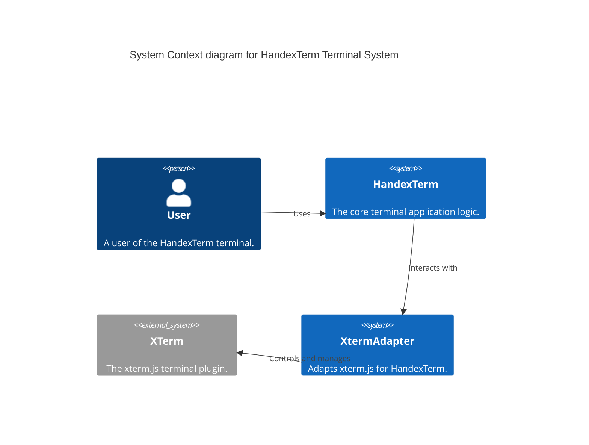
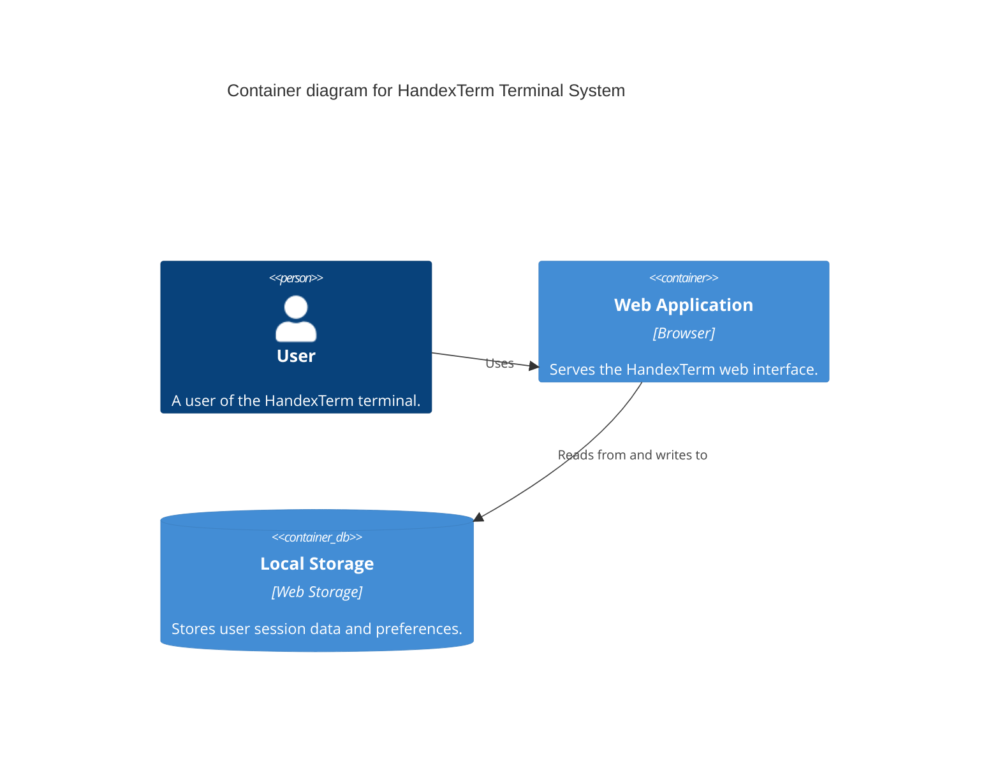

## Context



## Container



## Component

```mermaid
C4Component
title Component diagram for HandexTerm Web Application

Container(webApp, "Web Application", "Browser", "Serves the HandexTerm web interface.")

Component(handexTerm, "HandexTerm", "TypeScript", "Processes user commands and manages session.")
Component(xtermAdapter, "XtermAdapter", "TypeScript", "Adapts xterm.js for HandexTerm.")
Component(xterm, "XTerm", "JavaScript Library", "Provides terminal interface in the browser.")
Component(persistence, "Persistence", "TypeScript", "Handles saving and retrieving session data.")

Rel(user, handexTerm, "Inputs commands into")
Rel(handexTerm, xtermAdapter, "Sends processed commands to")
Rel(xtermAdapter, xterm, "Uses for terminal I/O")
Rel(handexTerm, persistence, "Stores and retrieves data with")
```